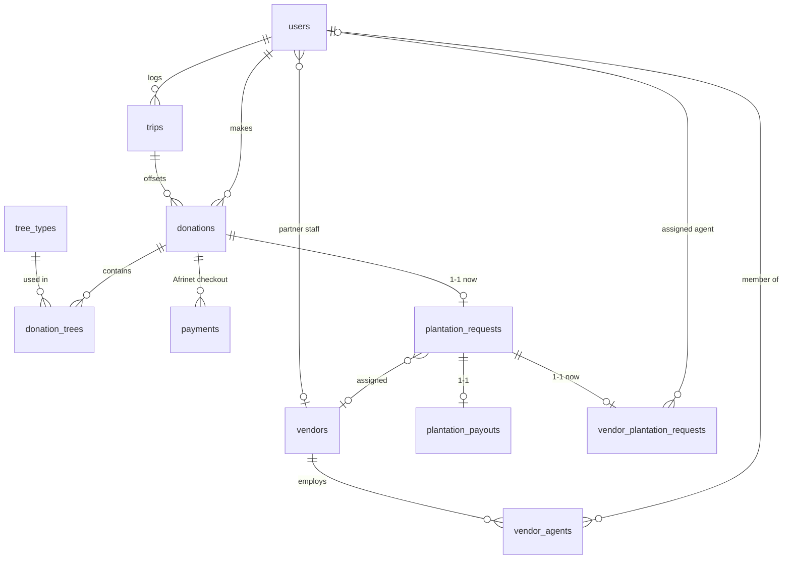

# OTOT data model

Canonical schema for One Tourist One Tree (`bakend/src/db/migrations/`). The SPA talks only to the Express API (`bakend`); Postgres is owned by that service. Authorization is application-layer JWT, not Supabase RLS.

Flight CO₂ is calculated by `emission_calculator`. Tree mix, donation amount, payments, and plantation ops live in `bakend`.

## Entity diagram

## Tables

### `users`

Single account table for every portal. Ministry is a role, not a separate org. Partner staff also set `vendor_id` and a row in `vendor_agents`.

| Column | Type | Notes |
|---|---|---|
| `id` | TEXT PK | UUID (or seeded demo id) |
| `email` | TEXT UNIQUE | Lowercased |
| `name` | TEXT | |
| `role` | TEXT | See roles below |
| `vendor_id` | TEXT FK → vendors | Set for partner_admin / partner_agent |
| `ministry_role` | TEXT | `admin` \| `user` for ministry staff; otherwise NULL |
| `password_hash` | TEXT | bcrypt |
| `created_at` | TIMESTAMPTZ | |

**Roles:** `tourist` · `ministry_admin` · `ministry_user` · `partner_admin` · `partner_agent` · `super_admin`

Tourists self-signup. Ministry and partner accounts are provisioned (seeded in demo). JWT payload: `id`, `email`, `name`, `role`, optional `vendorId` / `ministryRole`. Default expiry 7 days. No OAuth.

| Role | Reads | Writes |
|---|---|---|
| `tourist` | Own trips / donations / payments / related requests | Signup, checkout, create/delete trips, tree-mix quote |
| `ministry_user` | Full store | None |
| `ministry_admin` | Full store | Create/assign/complete plantation requests, mock payouts |
| `partner_admin` | Vendor-scoped store | Create vendor plantation request, update any assignment for that vendor |
| `partner_agent` | Vendor-scoped store | PATCH own vendor plantation request |
| `super_admin` | Full store | All of the above + tree types, vendors, reset-demo |

### `vendors`

Plantation partner organisation (group).

| Column | Type | Notes |
|---|---|---|
| `id` | TEXT PK | |
| `name` | TEXT | |
| `region` | TEXT | |
| `status` | TEXT | `active` \| `inactive` |
| `mpesa_phone` | TEXT | B2C destination, `2547XXXXXXXX`. Required before ministry payout |

### `vendor_agents`

Membership of a user in a vendor.

| Column | Type | Notes |
|---|---|---|
| `id` | TEXT PK | |
| `user_id` | TEXT FK → users | |
| `vendor_id` | TEXT FK → vendors | |
| `role` | TEXT | `admin` \| `agent` |

Unique `(user_id, vendor_id)`.

### `tree_types`

Catalog used to turn a CO₂ volume into a donation amount.

| Column | Type | Notes |
|---|---|---|
| `id` | TEXT PK | |
| `name` | TEXT | e.g. Acacia |
| `scientific_name` | TEXT | |
| `offset_kg` | NUMERIC(12,2) | Lifetime sequestration assumed per tree |
| `cost_per_tree` | NUMERIC(12,2) | USD plantation cost |
| `active` | BOOLEAN | Inactive types are excluded from mix quotes |

Seeded: Acacia 160 kg / $8, Croton 140 kg / $7, African Cedar 200 kg / $12.

### `trips`

Tourist calculator result. Optional parent of a donation when the traveler offsets that trip.

| Column | Type | Notes |
|---|---|---|
| `id` | TEXT PK | UUID (or seeded demo id) |
| `user_id` | TEXT FK → users | Tourist |
| `origin_airport` | TEXT | IATA |
| `destination_airport` | TEXT | IATA |
| `travel_class` | TEXT | `economy` \| `premium_economy` \| `business` \| `first` |
| `is_return` | BOOLEAN | |
| `from_date` | DATE | |
| `to_date` | DATE | |
| `accommodation_type` | TEXT | `none` \| `hotel` \| `rental` \| `cruise` \| `service_apartment` |
| `num_travelers` | INTEGER | ≥ 1 |
| `flight_co2` | NUMERIC(12,2) | kg |
| `accommodation_co2` | NUMERIC(12,2) | kg |
| `total_co2` | NUMERIC(12,2) | kg |
| `trees_needed` | INTEGER | Suggested mix count at save time |
| `distance_km` | NUMERIC(12,2) | Optional |
| `entry_source` | TEXT | `Manual` \| `Partner` |
| `friendly_trip_id` | TEXT | Display id, e.g. `OT-1001` |
| `created_at` | TIMESTAMPTZ | |

Delete is refused when a paid donation is linked. `trees_needed` vs trees on linked paid donations drives Fully / Partially / Not Offset.

### `donations`

Tourist pledge. Starts `pending_payment` until Afrinet webhook/sync marks it `paid`.

| Column | Type | Notes |
|---|---|---|
| `id` | TEXT PK | |
| `user_id` | TEXT FK → users | Tourist |
| `trip_id` | TEXT FK → trips | Optional; SET NULL if the trip is removed |
| `requested_carbon_offset_kg` | NUMERIC(12,2) | Target from the trip calculator (client input) |
| `carbon_offset_kg` | NUMERIC(12,2) | **Server-computed** mix offset: Σ count × `tree_types.offset_kg` |
| `amount` | NUMERIC(12,2) | **Server-computed** mix cost: Σ count × `cost_per_tree` |
| `status` | TEXT | `pending_payment` \| `paid` \| `refunded` |
| `created_at` | TIMESTAMPTZ | |

Checkout inserts `pending_payment`. `paid` is set only after Afrinet reports `COMPLETED`. `refunded` is unused.

The API still returns `trees: TreeLine[]` by joining `donation_trees`.

### `donation_trees`

Nested tree type + count. Source of truth (JSONB `donations.trees` was removed).

| Column | Type | Notes |
|---|---|---|
| `id` | TEXT PK | `{donation_id}:{tree_type_id}` |
| `donation_id` | TEXT FK → donations | Cascade delete |
| `tree_type_id` | TEXT FK → tree_types | |
| `count` | INTEGER | `> 0` |

Unique `(donation_id, tree_type_id)`.

### `payments`

Afrinet hosted checkout. Several attempts per donation are allowed. `external_reference` is the Afrinet idempotency key (`DON-…-n`).

| Column | Type | Notes |
|---|---|---|
| `id` | TEXT PK | |
| `donation_id` | TEXT FK → donations | |
| `payment_mode` | TEXT | Updated from webhook: `Card` \| `M-Pesa` \| `Bank Transfer` |
| `status` | TEXT | `pending` until webhook/`sync`; then `success` or `failed` |
| `amount` | NUMERIC(12,2) | USD catalog total |
| `plantation` | NUMERIC(12,2) | Charge split |
| `platform` | NUMERIC(12,2) | 5% |
| `processor` | NUMERIC(12,2) | 2.9% |
| `external_reference` | TEXT UNIQUE | Afrinet `reference` |
| `afrinet_transaction_code` | TEXT | Engine transaction code |
| `afrinet_status` | TEXT | Last provider status |
| `checkout_url` | TEXT | Redirect target from `charges.create` |
| `mpesa_receipt` | TEXT | From webhook if M-Pesa |
| `failure_message` | TEXT | |
| `currency` | TEXT | Charged currency (`KES` after checkout) |
| `amount_kes` | INTEGER | Whole shillings sent to Afrinet |
| `created_at` | TIMESTAMPTZ | |

`plantation = amount − platform − processor`.

### `webhook_events`

Audit log of Afrinet callbacks (`POST /webhooks/afrinet`). Idempotent settle uses `reference` / `transaction_code` on payments and payouts.

### `plantation_requests`

Ministry work order. **1:1 with donation today** (`donation_id` UNIQUE). Paid checkout (Afrinet `COMPLETED`) auto-creates a row with status `unassigned`. Ministry assigns a vendor. Manual `POST /v1/plantation-requests` is idempotent (returns the existing row) and requires a paid donation.

| Column | Type | Notes |
|---|---|---|
| `id` | TEXT PK | |
| `donation_id` | TEXT UNIQUE FK → donations | Future: many donations may combine into one request |
| `status` | TEXT | See status machine |
| `assigned_to` | TEXT FK → users | Partner admin contact when assigned |
| `partner_id` | TEXT FK → vendors | Assigned organisation |
| `amount` | NUMERIC(12,2) | Donation gross amount |
| `created_at` | TIMESTAMPTZ | |

**Status:** `unassigned` → `assigned` → `in_progress` → `ready_for_review` → `completed`

`in_progress` is set when a vendor plantation request is created. `ready_for_review` is set when every mapped vendor request is `completed`. Ministry can mark `completed` only then.

### `vendor_plantation_requests`

Vendor-side job. **1:1 with plantation_request today** (`plantation_request_id` UNIQUE). Partner admin assigns an agent in that vendor.

| Column | Type | Notes |
|---|---|---|
| `id` | TEXT PK | |
| `plantation_request_id` | TEXT UNIQUE FK | Future: several vendor jobs per ministry request |
| `vendor_id` | TEXT FK → vendors | |
| `assigned_agent_id` | TEXT FK → users | Must be `partner_agent` of `vendor_id` |
| `status` | TEXT | `assigned` → `in_progress` → `completed` |
| `created_at` | TIMESTAMPTZ | |

Agents may only PATCH their own row. Partner admins may PATCH any row for their vendor.

### `plantation_payouts`

Partner B2C payout via Afrinet after ministry completes the request. **1:1 with plantation_request**.

| Column | Type | Notes |
|---|---|---|
| `id` | TEXT PK | |
| `plantation_request_id` | TEXT UNIQUE FK | |
| `amount` | NUMERIC(12,2) | Plantation share (USD) |
| `payout_status` | TEXT | `pending` \| `processing` \| `paid` \| `failed` |
| `transaction_id` | TEXT | Afrinet transaction code |
| `transaction_reference_number` | TEXT | Our `PO-…` idempotency key |
| `failure_message` | TEXT | |
| `created_at` | TIMESTAMPTZ | |

## Carbon offset → donation amount

1. Tourist calculates trip CO₂ via `emission_calculator` (`POST /api/v1/carbon-calculator/calculate`). That service’s generic `$10` / 840 kg tree estimate is **not** used.
2. Frontend (and `POST /v1/tree-mix/quote`) picks up to three active species and sets `count = ceil((target / n) / offset_kg)` per species (minimum 1).
3. `amount = Σ count × cost_per_tree`. `carbon_offset_kg = Σ count × offset_kg`.
4. Checkout persists the client target as `requested_carbon_offset_kg` and the mix totals as `amount` / `carbon_offset_kg`. Tree lines go to `donation_trees`.

## Live flow

1. Tourist picks Card or M-Pesa.
   - M-Pesa: STK prompt, then `/donate/awaiting/:paymentId`.
   - Card: redirect to Afrinet `HOSTED_CHECKOUT`; `returnUrl` / `cancelUrl` land back on awaiting.
2. Webhook `POST /webhooks/afrinet` (and optional `/v1/payments/:id/sync`) settles `COMPLETED` → donation `paid` + unassigned `plantation_requests`.
3. Ministry admin assigns a vendor (`assigned_to` = that vendor’s partner admin).
4. Partner admin creates `vendor_plantation_requests` for an agent → parent status `in_progress`.
5. Agent (or vendor admin) moves vendor status to `completed`. When all sibling vendor jobs are complete, parent becomes `ready_for_review`.
6. Ministry admin marks the plantation request `completed`, then may create an Afrinet B2C `plantation_payouts` row (vendor `mpesa_phone` required).

## API (authenticated unless noted)

| Method | Path | Who |
|---|---|---|
| `GET` | `/health` | public |
| `GET` | `/ready` | public |
| `POST` | `/v1/auth/login` | public |
| `POST` | `/v1/auth/signup` | public (tourist) |
| `GET` | `/v1/auth/me` | any signed-in user |
| `POST` | `/v1/auth/logout` | client-side; server no-op |
| `GET` | `/v1/store` | signed-in; role-scoped snapshot |
| `POST` | `/v1/tree-mix/quote` | signed-in |
| `POST` | `/v1/trips` | tourist |
| `DELETE` | `/v1/trips/:id` | tourist (own trip; blocked if paid trees exist) |
| `POST` | `/v1/donations/checkout` | tourist — pending donation, returns `checkoutUrl` |
| `GET` | `/v1/payments/:id` | owner / staff |
| `POST` | `/v1/payments/:id/sync` | tourist — local mock completes when Afrinet is off; live waits on webhook |
| `POST` | `/v1/donations/:id/retry` | tourist — new pending payment + checkout URL |
| `POST` | `/webhooks/afrinet` | public, HMAC |
| `POST` | `/v1/plantation-requests` | ministry admin (idempotent) |
| `POST` | `/v1/plantation-requests/:id/assign` | ministry admin |
| `POST` | `/v1/plantation-requests/:id/complete` | ministry admin |
| `POST` | `/v1/payouts` | ministry admin |
| `POST` | `/v1/vendor-plantation-requests` | partner admin |
| `PATCH` | `/v1/vendor-plantation-requests/:id` | partner admin / assigned agent |
| `PUT` | `/v1/tree-types` | super admin |
| `PUT` | `/v1/vendors` | super admin |
| `POST` | `/v1/admin/reset-demo` | super admin |

## Intentionally not built yet

- OAuth / SSO
- Combining several donations into one plantation request (drop `plantation_requests.donation_id` UNIQUE and add a join table)
- Several vendor jobs per ministry request (drop `vendor_plantation_requests.plantation_request_id` UNIQUE)
- Ministry / vendor user-invite CRUD
- Proof-of-planting uploads

## Afrinet ops

- Portal callback is `https://onetouristonetree.com/webhooks/afrinet` (this API). Must return 2xx.
- M-Pesa: SDK `charges.create` with `paymentType: "mpesa"` C2B STK.
- Card: SDK `charges.create` with `paymentType: "card"`, `mode: "HOSTED_CHECKOUT"`, `returnUrl` / `cancelUrl`.
- Sandbox card may still fail with `CARD_PROVIDER_ERROR`; tourists can switch to M-Pesa.
- Use sandbox until live `api.afrinet.global` accepts the merchant key.
- Fund the merchant wallet before B2C payouts (`INSUFFICIENT_FUNDS` otherwise).
- Secrets on the API service only. Never `VITE_*`.

## Demo accounts

Password `Test1234!` for all seeded users: `tourist@demo.otot.app`, `ministry@demo.otot.app`, `ministryuser@demo.otot.app`, `partner@demo.otot.app`, `partneragent@demo.otot.app`, `superadmin@demo.otot.app`.
