# OTOT — Supabase to Postgres + Node.js API Migration Plan

**Supabase → Postgres + Node.js API** · Feature-by-feature endpoint specification · Generated 2026-09-07

---

## How to Read This Document

1. **1. Data Model**: Entity overview, Mermaid ER diagrams (default view), and detailed column-level schema tables.
2. **2–24**: One feature per section — recommended REST endpoints, what Supabase behavior each replaces, and frontend wiring notes.

**Tags:**
- NEW — no Supabase equivalent; current UI is mock
- REPLACES — existing Supabase behavior
- MOCK — current page is hardcoded

> The single biggest migration change: today the React app talks to Postgres directly via `supabase.from('table')` and safety comes from 368 RLS policies. On Postgres + Node, the browser never touches the DB — every read/write becomes an authenticated REST call, and all RLS logic moves into API-layer authorization middleware. The ~15 Postgres helper functions that exist only to power RLS become plain middleware functions in Node.

---

## 1. Data Model

The Postgres schema mirrors the current 149-migration Supabase structure with a cleaner dependency graph. Each subsection covers one domain: Mermaid ER diagram (diagram view) plus text schema tables.

**Note:** Mermaid ER diagrams render natively in GitHub, GitLab, VS Code, and most markdown viewers.

---

### 1a. Entity Overview by Domain

| Domain | Tables | Role in the system |
|---|---|---|
| **Identity & Auth** | `users`, `roles`, `user_roles` (legacy), `magic_tokens`, `ephemeral_sessions`, `lodge_credentials`, `lodge_sessions`, `auth_logs` | Who can log in, how, and what they can do. |
| **Organizations & Permissions** | `organizations`, `partner_types`, `partner_type_modules`, `modules`, `module_sub_actions`, `organization_modules`, `org_users`, `org_custom_roles`, `org_role_permissions`, `org_user_permissions`, `org_job_role_defaults`, `tourist_module_permissions` | Multi-tenant org structure, module licensing, fine-grained permissions. |
| **Trips & Carbon** | `trips`, `carbon_offset_calculations`, `tree_sequestration_rates` | Tourist trip logging and CO₂ → trees-needed math. |
| **Pledges & Payments** | `contribution_tiers`, `contribution_tier_visibility`, `tourist_purchases`, `planting_cost_configs`, `planting_cost_submissions`, `planting_cost_notifications`, `partner_transactions`, `wallet_settings` | Monetary flow: tiers → checkout → payment gateway → ledger. |
| **Trees (core)** | `trees`, `tree_status_transitions`, `tree_geotags`, `tree_growth_metrics`, `tree_survival_tracking`, `tree_survival_records`, `tree_monitoring_logs`, `tree_planting_assignments`, `tree_carers` | One tree → many lifecycle events. |
| **Contributions & Ledger** | `contribution_tracking`, `owner_disbursements`, `contributions` | Every financial or tree-based contribution fans out to the ledger. |
| **Agents & Tickets** | `travel_agents`, `agent_tickets` | B2B agent flow: ticket → trip → trees. |
| **Lodges** | `lodges`, `reimbursements`, `reimbursement_docs` | Lodge-specific: tree planting, reimbursements. |
| **Nurseries & Species** | `nurseries`, `nursery_species`, `seed_species`, `seedling_batches`, `planting_records`, `monitoring_records` | Owner-side propagation: species → batches → planting → monitoring. |
| **MDM (location hierarchy)** | `mdm_location_counties`, `mdm_location_subcounties`, `mdm_location_blocks`, `mdm_location_stations`, `mdm_location_beats`, `mdm_audit_log` | Five-level administrative geography. |
| **Documents** | `certificates`, `document_templates`, `template_designs`, `template_assignments`, `template_categories`, `template_engine_flags` | PDF generation, template management, certificate issuance. |
| **Engagement & Impact** | `impact_metrics`, `carbon_metrics_logs`, `community_impact`, `community_impact_logs`, `ecosystem_impact_logs`, `monitoring_logs`, `engagement_activities`, `tree_impact_records` | Near-duplicate log tables — candidates for consolidation. |
| **Platform Config** | `notifications`, `activity_logs`, `integration_logs`, `api_keys`, `settings` (proposed) | Notifications, audit trail, partner integrations. |
| **Views / Virtual** | `v_contribution_source_drift` | Reconciliation drift. |

---

### 1b. Identity & Auth Schema

**ER Diagram:**

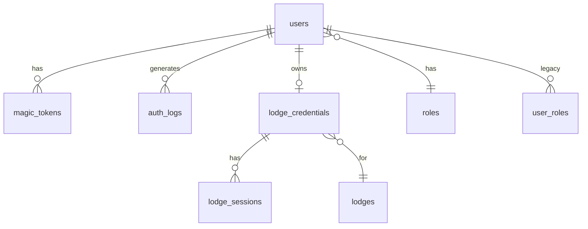

**Schema Details:**

| Table | Column | Type | Constraints | Notes |
|---|---|---|---|---|
| **users** | id | uuid | PK, NN, default gen_random_uuid() | |
| | email | text | UK, NN | Login identity |
| | full_name | text | | |
| | phone | text | | |
| | photo_url | text | | Profile picture |
| | bio | text | | |
| | role_id | uuid | FK→roles.id, NN | Primary role |
| | organization_id | uuid | FK→organizations.id | Null for tourists |
| | password_hash | text | | bcrypt hash |
| | email_verified | boolean | default false | |
| | active | boolean | default true | |
| **roles** | id | uuid | PK, NN | |
| | name | text | UK, NN | super_admin\|owner\|gov_partner\|travel_agent\|lodge\|tourist |
| | description | text | | |
| **user_roles** (legacy) | id | uuid | PK, NN | Drop during migration |
| | user_id | uuid | FK→users.id, NN | |
| | role | text | | Legacy enum |
| **magic_tokens** | id | uuid | PK, NN | |
| | user_id | uuid | FK→users.id | Set after find-or-create |
| | token_hash | text | UK, NN | SHA-256 |
| | email | text | NN | Denormalized |
| | pledge_context | jsonb | | {numTrees, tripId, dedication} |
| | device_fingerprint | text | | Optional fraud signal |
| | expires_at / consumed_at | timestamptz | | 24h TTL |
| **ephemeral_sessions** | id | uuid | PK, NN | |
| | token | text | UK, NN | Random secret |
| | data | jsonb | | Session payload |
| | expires_at | timestamptz | | |
| **lodge_credentials** | id | uuid | PK, NN | |
| | lodge_id | uuid | FK→lodges.id, NN | 1:1 in practice |
| | username | text | UK, NN | |
| | password_hash | text | NN | bcrypt |
| | active | boolean | default true | |
| **lodge_sessions** | id | uuid | PK, NN | |
| | lodge_credential_id | uuid | FK→lodge_credentials.id, NN | |
| | token / expires_at | text / timestamptz | UK (token), NN | 7-day expiry |
| **auth_logs** | id | uuid | PK, NN | |
| | user_id | uuid | FK→users.id | Null for failed attempts |
| | event | text | NN | login\|logout\|signup\|reset\|verify\|magic_link |
| | ip_address / user_agent | text | | |
| | success | boolean | NN, default true | |
| | created_at | timestamptz | | |

**Relationships:** `users.role_id → roles` (many-to-one). `users → user_roles` (one-to-many, legacy — drop). `users → magic_tokens` (one-to-many, 24h TTL). `users → lodge_credentials` (one-to-many, 1:1 in practice). `lodge_credentials → lodge_sessions` (one-to-many). `users → auth_logs` (one-to-many, append-only audit).

---

### 1c. Organizations & Permissions Schema

**ER Diagram:**

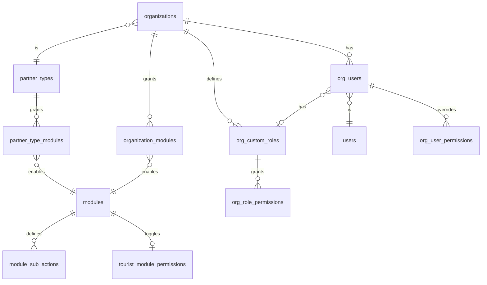

**Schema Details:**

| Table | Column | Type | Constraints | Notes |
|---|---|---|---|---|
| **organizations** | id | uuid | PK, NN | |
| | name | text | NN | |
| | description | text | | |
| | partner_type_id | uuid | FK→partner_types.id | Determines default module set |
| | status | text | default 'active' | active\|suspended\|archived |
| | verification_status | text | | pending\|verified\|rejected |
| | settings | jsonb | | Per-org config |
| | created_at / updated_at | timestamptz | | |
| **partner_types** | id | uuid | PK, NN | |
| | name | text | UK, NN | owner\|government_partner\|… |
| | description | text | | |
| **partner_type_modules** | id | uuid | PK, NN | |
| | partner_type_id | uuid | FK→partner_types.id, NN | |
| | module_id | uuid | FK→modules.id, NN | |
| **modules** | id | uuid | PK, NN | |
| | key | text | UK, NN | trees\|finance\|mdm\|nursery\|reports\|… |
| | name | text | NN | Human-readable |
| | description | text | | |
| | sort_order | integer | default 0 | Sidebar ordering |
| **module_sub_actions** | id | uuid | PK, NN | |
| | module_id | uuid | FK→modules.id, NN | |
| | key | text | UK (module_id, key), NN | view\|create\|edit\|delete\|approve |
| | label | text | NN | "View trees", "Approve costs" |
| | sort_order | integer | default 0 | |
| **organization_modules** | id | uuid | PK, NN | |
| | organization_id | uuid | FK→organizations.id, NN | |
| | module_id | uuid | FK→modules.id, NN | |
| | enabled | boolean | default false | Overrides partner_type_modules |
| | granted_at | timestamptz | | |
| **org_users** | id | uuid | PK, NN | |
| | organization_id | uuid | FK→organizations.id, NN | |
| | user_id | uuid | FK→users.id, NN | UK (org_id, user_id) |
| | job_role | text | | "Finance Manager", "Field Officer" |
| | custom_role_id | uuid | FK→org_custom_roles.id | |
| | status | text | | active\|invited\|suspended |
| | joined_at | timestamptz | | |
| **org_custom_roles** | id | uuid | PK, NN | |
| | organization_id | uuid | FK→organizations.id, NN | |
| | module_id | uuid | FK→modules.id, NN | Role scoped to one module |
| | name | text | NN | "Approver", "Viewer" |
| **org_role_permissions** | id | uuid | PK, NN | |
| | custom_role_id | uuid | FK→org_custom_roles.id, NN | |
| | module_id | uuid | FK→modules.id, NN | |
| | action | text | NN | view\|create\|edit\|delete\|approve |
| | allowed | boolean | NN, default true | |
| **org_user_permissions** | id | uuid | PK, NN | |
| | org_user_id | uuid | FK→org_users.id, NN | |
| | module_id | uuid | FK→modules.id, NN | |
| | action | text | NN | |
| | allowed | boolean | NN, default true | User-level override |
| **org_job_role_defaults** | id | uuid | PK, NN | |
| | organization_id | uuid | FK→organizations.id, NN | |
| | module_id | uuid | FK→modules.id, NN | |
| | job_role | text | UK (org_id, module_id, job_role), NN | "Finance Manager" |
| | default_permissions | jsonb | NN | {view: true, edit: true} |
| **tourist_module_permissions** | id | uuid | PK, NN | |
| | module_id | uuid | FK→modules.id, UK, NN | One row per module |
| | visible | boolean | NN, default false | Show in tourist sidebar? |
| | sort_order | integer | default 0 | |

**Relationships:** `organizations → partner_types` (many-to-one). `partner_types → partner_type_modules → modules` (many-to-many). `organizations → organization_modules → modules` (many-to-many, overrides defaults). `organizations → org_users → users` (many-to-many). `org_users → org_custom_roles` (many-to-one, optional). `org_custom_roles → org_role_permissions` (one-to-many). `modules → module_sub_actions` (one-to-many). `modules → tourist_module_permissions` (one-to-one toggle).

---

### 1d. Trips & Carbon Schema

**ER Diagram:**

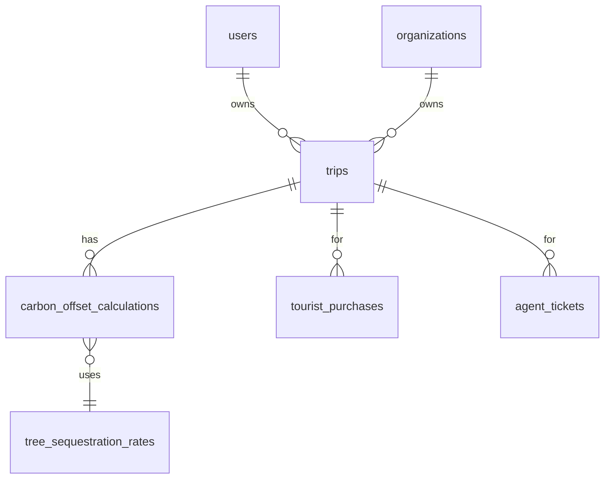

**Schema Details:**

| Table | Column | Type | Constraints | Notes |
|---|---|---|---|---|
| **trips** | id | uuid | PK, NN | |
| | user_id | uuid | FK→users.id | |
| | organization_id | uuid | FK→organizations.id | Org-scoped for agents/partners |
| | friendly_trip_id | text | UK | Generated server-side |
| | origin_airport | text | | |
| | destination_airport | text | | |
| | travel_class | text | | economy\|business\|first |
| | travel_date | date | | |
| | travelers_count | integer | default 1 | |
| | carbon_kg | decimal | | Calculated |
| | trees_needed | integer | | Based on CO₂ |
| | status | text | | draft\|confirmed\|completed |
| | flight_legs_json | jsonb | | |
| **carbon_offset_calculations** | id | uuid | PK, NN | |
| | trip_id | uuid | FK→trips.id, NN | |
| | user_id | uuid | FK→users.id | |
| | sequestration_rate_id | uuid | FK→tree_sequestration_rates.id | |
| | total_carbon_kg | decimal | | |
| | trees_needed | integer | | |
| | calculation_details | jsonb | | Full calc snapshot |
| **tree_sequestration_rates** | id | uuid | PK, NN | |
| | species_key | text | UK, NN | FK to seed_species.key |
| | region | text | UK, NN | Geographic region |
| | co2_per_tree_per_year | decimal | | |
| | mature_height_m | decimal | | |
| | years_to_maturity | integer | | |
| | active | boolean | default true | |
| | valid_from / valid_to | timestamptz | | Rate validity window |

**Relationships:** `trips.user_id → users` (many-to-one). `trips.organization_id → organizations` (many-to-one, org-scoped for agents/partners). `trips → carbon_offset_calculations` (one-to-many). `carbon_offset_calculations → tree_sequestration_rates` (many-to-one, species rate at time of calc). `trips → tourist_purchases` (one-to-many, pledge context). `trips → agent_tickets` (one-to-many, B2B context).

---

### 1e. Pledges & Payments Schema

**ER Diagram:**

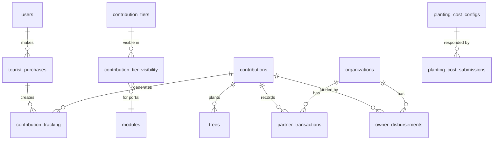

**Schema Details:**

| Table | Column | Type | Constraints | Notes |
|---|---|---|---|---|
| **contribution_tiers** | id | uuid | PK, NN | |
| | key | text | UK, NN | tier_25\|tier_50\|tier_100 |
| | name | text | NN | Display name |
| | price | decimal | NN | Amount in currency |
| | trees_count | integer | NN | Trees per tier |
| | currency | text | | KES\|USD\|EUR |
| | active | boolean | default true | |
| **contribution_tier_visibility** | id | uuid | PK, NN | |
| | tier_id | uuid | FK→contribution_tiers.id, NN | |
| | portal_type | text | NN | tourist\|agent\|lodge |
| | module_id | uuid | FK→modules.id | |
| | visible | boolean | default true | |
| **tourist_purchases** | id | uuid | PK, NN | |
| | user_id | uuid | FK→users.id | |
| | tier_id | uuid | FK→contribution_tiers.id | |
| | trip_id | uuid | FK→trips.id | |
| | purchase_type | text | | One-time\|Subscription |
| | payment_method | text | | card\|mpesa\|bank\|paypal |
| | payment_reference | text | UK | Gateway ref |
| | payment_status | text | | pending\|paid\|failed\|refunded |
| | amount_paid | decimal | | |
| | dedication | text | | |
| | trees_allocated | integer | | |
| **contributions** | id | uuid | PK, NN | |
| | user_id | uuid | FK→users.id | |
| | organization_id | uuid | FK→organizations.id | |
| | contribution_id | text | UK | Human-readable: OTOT-YYYY-XXXXX |
| | total_amount | decimal | NN | |
| | currency | text | | KES\|USD |
| | status | text | | pending\|partial\|complete\|cancelled |
| | source_type | text | | tourist\|agent\|partner\|lodge |
| **contribution_tracking** | id | uuid | PK, NN | The ledger |
| | contribution_id | uuid | FK→contributions.id, NN | |
| | source_table | text | NN | tourist_purchases\|agent_tickets\|partner_transactions\|owner_disbursements |
| | source_id | uuid | NN | Polymorphic FK |
| | source_contribution_id | text | UK | Text business key (no FK enforcement) |
| | amount | decimal | NN | |
| | currency | text | | KES\|USD |
| | recipient_type | text | | ktb\|tech\|institution\|partner\|owner |
| | receipt_status | text | | pending\|confirmed\|rejected |
| | retained_amount | decimal | | Platform retain |
| | transferred_amount | decimal | | |
| **partner_transactions** | id | uuid | PK, NN | |
| | organization_id | uuid | FK→organizations.id, NN | |
| | contribution_id | uuid | FK→contributions.id | |
| | transaction_type | text | | purchase\|disbursement\|allocation |
| | amount | decimal | NN | |
| | status | text | | pending\|approved\|rejected\|completed |
| **owner_disbursements** | id | uuid | PK, NN | |
| | organization_id | uuid | FK→organizations.id, NN | |
| | contribution_id | uuid | FK→contributions.id | |
| | status | text | | pending\|processing\|completed\|rejected |
| | amount | decimal | NN | |
| | payment_method | text | | bank_transfer\|mpesa\|cheque |

**Relationships:** `tourist_purchases.user_id → users` (many-to-one). `tourist_purchases.tier_id → contribution_tiers` (many-to-one). `tourist_purchases → contribution_tracking` (one-to-many). `contribution_tracking.contribution_id → contributions` (many-to-one). `contributions → partner_transactions` (one-to-many). `contributions → owner_disbursements` (one-to-many). `contribution_tier_visibility` joins tiers to portals/modules (many-to-many).

---

### 1f. Trees Schema

**ER Diagram:**

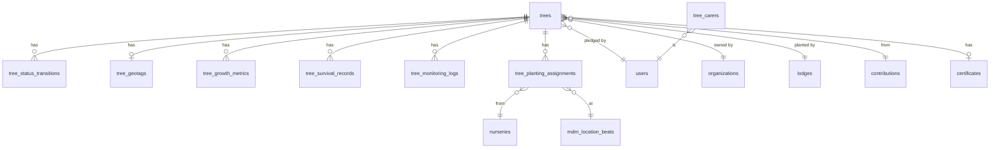

**Schema Details:**

| Table | Column | Type | Constraints | Notes |
|---|---|---|---|---|
| **trees** | id | uuid | PK, NN | |
| | tree_id | text | UK | Human-readable ID |
| | user_id | uuid | FK→users.id | Pledging user |
| | organization_id | uuid | FK→organizations.id | Owner org |
| | lodge_id | uuid | FK→lodges.id | Planting lodge |
| | contribution_id | uuid | FK→contributions.id | Financial link |
| | status | text | | pledged\|assigned\|planted\|growing\|mature\|surviving\|dead\|replaced |
| | planting_status | text | | pending\|assigned\|planted\|monitored |
| | species_key | text | FK→seed_species.key | |
| | tree_type | text | | indigenous\|exotic\|fruit |
| | planted_date | date | | |
| | lat / lng | text | | GPS coordinates |
| | health_status | text | | healthy\|stunted\|diseased\|replaced |
| | height_cm / diameter_cm | integer | | |
| | photo_urls | jsonb | | Array of URLs |
| **tree_status_transitions** | id | uuid | PK, NN | Append-only state log |
| | tree_id | uuid | FK→trees.id, NN | |
| | to_status | text | NN | New state |
| | transition_data | jsonb | | |
| | changed_by | uuid | FK→users.id | |
| **tree_geotags** | id | uuid | PK, NN | |
| | tree_id | uuid | FK→trees.id, UK, NN | 1:1 |
| | lat / lng | text | NN | |
| | source | text | | gps\|manual\|drone |
| **tree_survival_records** | id | uuid | PK, NN | Keep this one (consolidate tree_survival_tracking into it) |
| | tree_id | uuid | FK→trees.id, NN | |
| | survey_date | date | | |
| | status | text | | alive\|dead\|replaced\|missing |
| **tree_monitoring_logs** | id | uuid | PK, NN | |
| | tree_id | uuid | FK→trees.id, NN | |
| | log_type | text | | routine\|disease\|pest\|weather_damage |
| | trees_alive / dead / replaced | integer | | Rollup counts |
| **tree_planting_assignments** | id | uuid | PK, NN | |
| | tree_id | uuid | FK→trees.id, NN | |
| | contribution_id | uuid | FK→contributions.id | |
| | nursery_id | uuid | FK→nurseries.id | |
| | species_id | uuid | FK→seed_species.id | |
| | beat_id | uuid | FK→mdm_location_beats.id | |
| | planter_id | uuid | FK→users.id | tree_carer |
| | planned_planting_date | date | | |
| | actual_planting_date | date | | |
| **tree_carers** | id | uuid | PK, NN | Planter registry |
| | user_id | uuid | FK→users.id, UK, NN | 1:1 |
| | full_name | text | NN | |
| | phone | text | NN | |
| | beat_id | uuid | FK→mdm_location_beats.id | |

**Relationships:** `trees.user_id → users` (many-to-one, the pledging tourist). `trees.organization_id → organizations` (many-to-one, owner org). `trees.lodge_id → lodges` (many-to-one, planting lodge). `trees.contribution_id → contributions` (many-to-one). `trees → tree_status_transitions` (one-to-many, append-only state log). `trees → tree_geotags` (one-to-one, latest GPS). `trees → tree_growth_metrics` (one-to-many). `trees → tree_survival_records` (one-to-many). `trees → tree_monitoring_logs` (one-to-many). `trees → tree_planting_assignments` (one-to-many, nursery→beat→planter chain). `tree_carers.user_id → users` (one-to-one). `trees → certificates` (one-to-one).

---

### 1g. Contributions & Ledger Schema

**ER Diagram:**

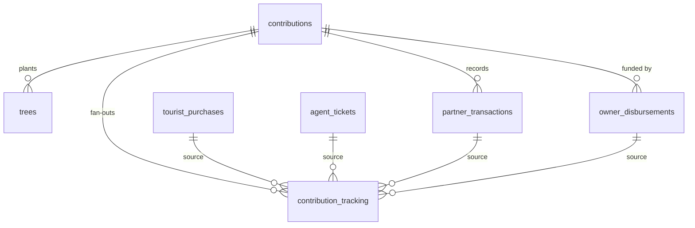

**Schema Details:**

| Table | Column | Type | Constraints | Notes |
|---|---|---|---|---|
| **contributions** | id | uuid | PK, NN | |
| | user_id | uuid | FK→users.id | |
| | organization_id | uuid | FK→organizations.id | |
| | contribution_id | text | UK | Human-readable: OTOT-YYYY-XXXXX |
| | total_amount | decimal | NN | |
| | currency | text | | KES\|USD |
| | status | text | | pending\|partial\|complete\|cancelled |
| | source_type | text | | tourist\|agent\|partner\|lodge |
| **contribution_tracking** | id | uuid | PK, NN | The ledger |
| | contribution_id | uuid | FK→contributions.id, NN | |
| | source_table | text | NN | Polymorphic: tourist_purchases\|agent_tickets\|partner_transactions\|owner_disbursements |
| | source_id | uuid | NN | Polymorphic FK |
| | source_contribution_id | text | UK | Text business key (no FK enforcement) |
| | amount | decimal | NN | |
| | currency | text | | KES\|USD |
| | recipient_type | text | | ktb\|tech\|institution\|partner\|owner |
| | receipt_status | text | | pending\|confirmed\|rejected |
| | retained_amount | decimal | | Platform retain |
| | transferred_amount | decimal | | |

**Relationships:** `contributions.user_id → users` (many-to-one). `contributions.organization_id → organizations` (many-to-one). `contribution_tracking.contribution_id → contributions` (many-to-one, the fan-out ledger). `contribution_tracking.source_table/source_id` — polymorphic FK to purchase, ticket, transaction, or disbursement. `source_contribution_id` — text business key shared across all source tables (no FK enforcement — keep the reconciliation endpoint).

---

### 1h. Agents & Tickets Schema

**ER Diagram:**

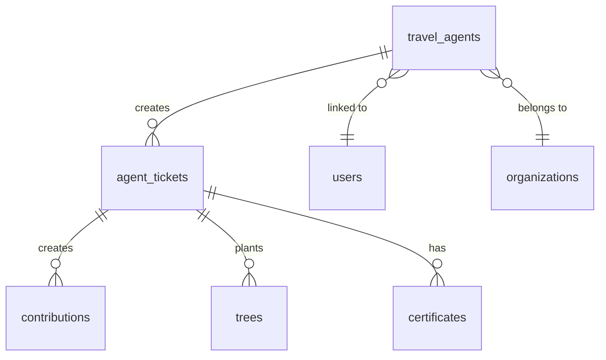

**Schema Details:**

| Table | Column | Type | Constraints | Notes |
|---|---|---|---|---|
| **travel_agents** | id | uuid | PK, NN | |
| | user_id | uuid | FK→users.id, UK | Nullable until linked |
| | organization_id | uuid | FK→organizations.id, NN | Gov partner org |
| | agent_code | text | UK | KTB-XXXX |
| | full_name | text | NN | |
| | email | text | NN | |
| | phone | text | | |
| | agency_name | text | | |
| | region | text | | |
| | status | text | | active\|suspended\|inactive |
| **agent_tickets** | id | uuid | PK, NN | |
| | agent_id | uuid | FK→travel_agents.id, NN | |
| | organization_id | uuid | FK→organizations.id, NN | |
| | ticket_number | text | UK | AGT-YYYY-XXXXX |
| | pnr | text | | Passenger Name Record |
| | passenger_name | text | NN | |
| | origin_airport / destination_airport | text | | |
| | travel_date | date | | |
| | carbon_offset_kg | decimal | | |
| | trees_needed / trees_planted | integer | | |
| | ktb_payment_status | text | | pending\|paid\|overdue |
| | status | text | | draft\|confirmed\|paid\|completed\|cancelled |
| | invoice_url / receipt_url | text | | Generated server-side |

**Relationships:** `travel_agents.user_id → users` (one-to-one, nullable until linked). `travel_agents.organization_id → organizations` (many-to-one, gov partner org). `travel_agents → agent_tickets` (one-to-many). `agent_tickets → contributions` (one-to-many, ticket creates a contribution + ledger rows on creation — port the triggers). `agent_tickets → trees` (one-to-many, trees planted from this ticket). `agent_tickets → certificates` (one-to-many, B2B certificates).

---

### 1i. Lodges Schema

**ER Diagram:**

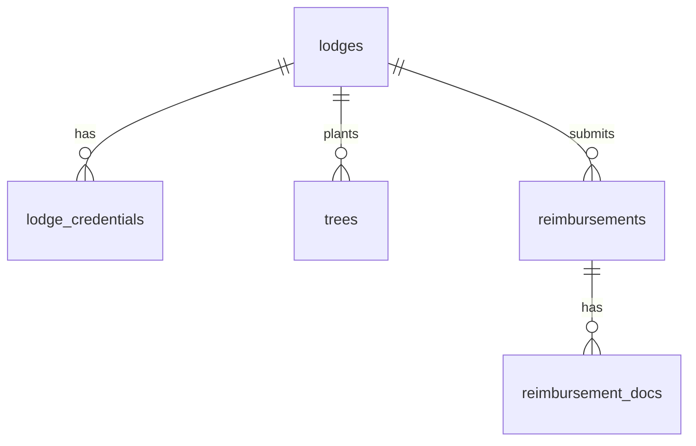

**Schema Details:**

| Table | Column | Type | Constraints | Notes |
|---|---|---|---|---|
| **lodges** | id | uuid | PK, NN | |
| | name | text | NN | |
| | location / region | text | | |
| | contact_person / email / phone | text | | |
| | status | text | | active\|suspended\|inactive |
| | trees_planted_target / current | integer | | |
| | settings | jsonb | | |
| **reimbursements** | id | uuid | PK, NN | |
| | lodge_id | uuid | FK→lodges.id, NN | |
| | type | text | | tree_planting\|maintenance\|logistics |
| | amount | decimal | NN | |
| | status | text | | pending\|approved\|rejected\|paid |
| | receipt_url | text | | |
| | approved_by | text | | |
| **reimbursement_docs** | id | uuid | PK, NN | |
| | reimbursement_id | uuid | FK→reimbursements.id, NN | |
| | file_url | text | NN | |
| | file_type | text | | pdf\|image\|excel |

**Relationships:** `lodges → lodge_credentials` (one-to-one, auth credentials — consolidate into JWT). `lodges → lodge_sessions` (one-to-many). `lodges → trees` (one-to-many, trees planted at this lodge). `lodges → reimbursements` (one-to-many). `reimbursements → reimbursement_docs` (one-to-many).

---

### 1j. Nurseries & Species Schema

**ER Diagram:**

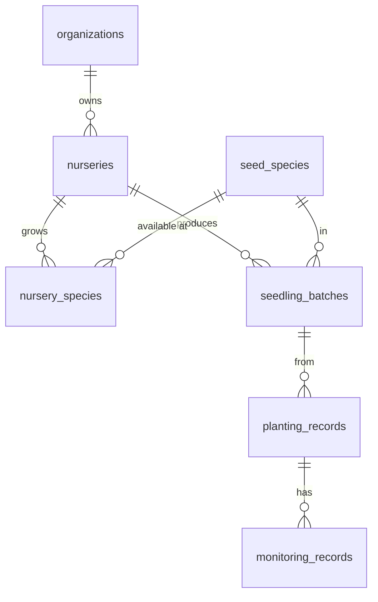

**Schema Details:**

| Table | Column | Type | Constraints | Notes |
|---|---|---|---|---|
| **nurseries** | id | uuid | PK, NN | |
| | organization_id | uuid | FK→organizations.id, NN | Owner org |
| | name | text | NN | |
| | location / region | text | | |
| | manager_name / phone / email | text | | |
| | capacity | integer | | Max seedlings |
| | current_stock | integer | | |
| | status | text | | active\|inactive |
| **seed_species** | id | uuid | PK, NN | |
| | key | text | UK, NN | ACME\|OCJC\|MART\|… |
| | common_name | text | NN | |
| | scientific_name | text | | |
| | years_to_maturity | integer | | |
| | co2_per_tree_per_year | decimal | | |
| | mature_height_m | decimal | | |
| | growth_rate | text | | slow\|medium\|fast |
| | water_requirement | text | | low\|medium\|high |
| | image_url | text | | |
| **nursery_species** | id | uuid | PK, NN | |
| | nursery_id | uuid | FK→nurseries.id, NN | |
| | species_id | uuid | FK→seed_species.id, NN | |
| | available_quantity | integer | default 0 | |
| | planted_count | integer | | |
| **seedling_batches** | id | uuid | PK, NN | |
| | nursery_id | uuid | FK→nurseries.id, NN | |
| | species_id | uuid | FK→seed_species.id, NN | |
| | batch_number | text | UK | NUR-YYYY-XXXX |
| | quantity | integer | NN | |
| | sow_date / expected_ready_date | date | | |
| | status | text | | sowing\|growing\|ready\|depleted |
| **planting_records** | id | uuid | PK, NN | |
| | batch_id | uuid | FK→seedling_batches.id, NN | |
| | nursery_id | uuid | FK→nurseries.id, NN | |
| | beat_id | uuid | FK→mdm_location_beats.id, NN | |
| | planting_date | date | | |
| | seedlings_planted / surviving | integer | | |
| | weather_conditions | text | | |
| | photo_urls | jsonb | | |
| **monitoring_records** | id | uuid | PK, NN | |
| | planting_record_id | uuid | FK→planting_records.id, NN | |
| | monitoring_date | date | | |
| | health_status | text | | excellent\|good\|fair\|poor\|critical |
| | alive_count / dead_count | integer | | |
| | issues | text | | drought\|pests\|disease\|vandalism |
| | avg_height_cm / survival_rate_pct | decimal | | |

**Relationships:** `nurseries.organization_id → organizations` (many-to-one, owner org). `nurseries → nursery_species` (one-to-many). `seed_species → nursery_species` (one-to-many, which nurseries carry it). `nurseries → seedling_batches` (one-to-many). `seedling_batches → planting_records` (one-to-many). `planting_records → monitoring_records` (one-to-many).

---

### 1k. MDM (Location Hierarchy) Schema

**ER Diagram:**

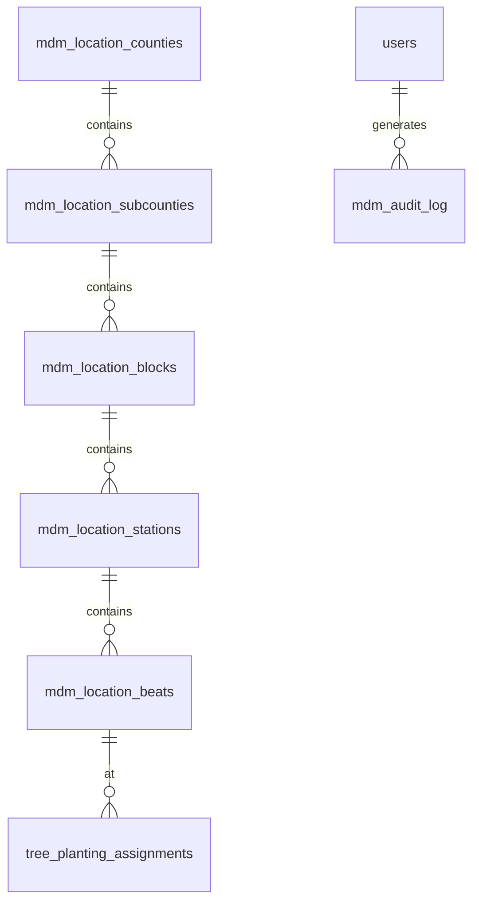

**Schema Details:**

| Table | Column | Type | Constraints | Notes |
|---|---|---|---|---|
| **mdm_location_counties** | id | uuid | PK, NN | |
| | code | text | UK, NN | 001\|002\|… |
| | name | text | NN | |
| | region | text | NN | |
| | status | text | | active\|inactive |
| **mdm_location_subcounties** | id | uuid | PK, NN | |
| | county_id | uuid | FK→mdm_location_counties.id, NN | |
| | code | text | UK, NN | |
| | name | text | NN | |
| | status | text | | active\|inactive |
| **mdm_location_blocks** | id | uuid | PK, NN | |
| | subcounty_id | uuid | FK→mdm_location_subcounties.id, NN | |
| | code | text | UK, NN | |
| | name | text | NN | |
| **mdm_location_stations** | id | uuid | PK, NN | |
| | block_id | uuid | FK→mdm_location_blocks.id, NN | |
| | code | text | UK, NN | |
| | name | text | NN | |
| **mdm_location_beats** | id | uuid | PK, NN | |
| | station_id | uuid | FK→mdm_location_stations.id, NN | |
| | code | text | UK, NN | |
| | name | text | NN | |
| | area_hectares | text | | |
| | target_trees / target_species | text | | |
| | status | text | | active\|inactive\|completed |
| **mdm_audit_log** | id | uuid | PK, NN | |
| | user_id | uuid | FK→users.id | |
| | action | text | NN | create\|update\|delete |
| | table_name | text | NN | Which MDM table |
| | record_id | uuid | | |
| | old_values / new_values | jsonb | | |

**Relationships:** Five-level hierarchy: county → subcounty → block → station → beat (each FK'd to the level above). `mdm_location_beats → tree_planting_assignments` (many-to-one). Every write to any MDM table appends an `mdm_audit_log` row (14 call sites currently do this manually — move it server-side).

---

### 1l. Documents Schema

**ER Diagram:**

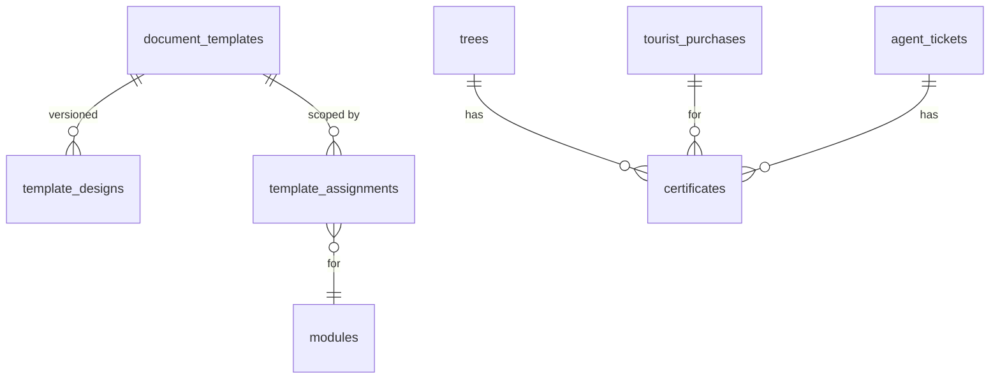

**Schema Details:**

| Table | Column | Type | Constraints | Notes |
|---|---|---|---|---|
| **document_templates** | id | uuid | PK, NN | |
| | key | text | UK, NN | certificate_tourist\|certificate_agent\|invoice\|receipt |
| | name | text | NN | |
| | category_id | uuid | FK→template_categories.id | |
| | status | text | | draft\|pending_approval\|approved\|archived |
| | current_version | text | | semver |
| **template_categories** | id | uuid | PK, NN | |
| | key | text | UK, NN | certificate\|invoice\|receipt\|report |
| | name | text | NN | |
| **template_designs** | id | uuid | PK, NN | |
| | template_id | uuid | FK→document_templates.id, NN | |
| | version | text | UK | 1.0.0\|1.1.0 |
| | design_json | text | | Full page layout spec |
| | status | text | | draft\|approved |
| | approved_by | uuid | FK→users.id | |
| **template_assignments** | id | uuid | PK, NN | |
| | template_id | uuid | FK→document_templates.id, NN | |
| | scope_type | text | NN | global\|portal\|partner\|organization |
| | scope_id | uuid | | module_id\|org_id\|partner_type_id |
| | priority | integer | | Lower = higher priority |
| | active | boolean | default true | |
| **certificates** | id | uuid | PK, NN | |
| | tree_id | uuid | FK→trees.id, UK | 1:1 |
| | user_id | uuid | FK→users.id, NN | Recipient |
| | purchase_id | uuid | FK→tourist_purchases.id | Transaction link |
| | certificate_number | text | UK | CERT-YYYY-XXXXX |
| | template_id | uuid | FK→document_templates.id | |
| | pdf_url | text | | |
| | qr_code_url | text | | |
| | verification_token | text | UK | For /verify/:id |
| | issued_at / expires_at | timestamptz | | |

**Relationships:** `document_templates → template_categories` (many-to-one). `document_templates → template_designs` (one-to-many, versioned). `template_assignments` joins templates to scopes (global, portal, partner, org) with priority. `certificates.tree_id → trees` (one-to-one). `certificates.user_id → users` (many-to-one). `certificates.purchase_id → tourist_purchases` (many-to-one).

---

### 1m. Engagement & Impact Schema

**ER Diagram:**

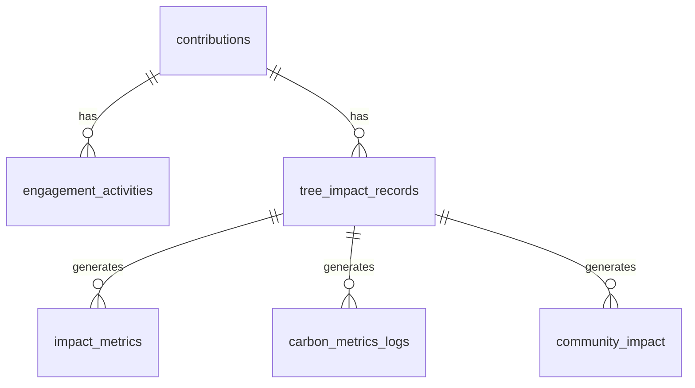

**Schema Details:**

| Table | Column | Type | Constraints | Notes |
|---|---|---|---|---|
| **engagement_activities** | id | uuid | PK, NN | |
| | contribution_id | uuid | FK→contributions.id, NN | |
| | activity_type | text | | email_sent\|update_posted\|photo_shared\|milestone |
| | title | text | NN | |
| | description | text | | |
| | is_public | boolean | default false | |
| | created_by | uuid | FK→users.id | |
| **tree_impact_records** | id | uuid | PK, NN | |
| | contribution_id | uuid | FK→contributions.id, NN | |
| | tree_id | uuid | FK→trees.id | |
| | record_type | text | | milestone\|update\|event |
| | title | text | NN | |
| | description | text | | |
| | tags | jsonb | | |
| | is_public | boolean | default false | |
| | created_by | uuid | FK→users.id | |
| **impact_metrics** | id | uuid | PK, NN | |
| | tree_impact_record_id | uuid | FK→tree_impact_records.id, NN | |
| | metric_type | text | | co2_sequestered\|survival_rate\|biodiversity |
| | metric_value | decimal | NN | |
| | unit | text | | kg\|percent\|count |
| **carbon_metrics_logs** | id | uuid | PK, NN | |
| | tree_impact_record_id | uuid | FK→tree_impact_records.id, NN | |
| | co2_absorbed_kg | decimal | | |
| | co2_annual_rate | decimal | | |
| | species_key | text | | |
| **community_impact** | id | uuid | PK, NN | |
| | tree_impact_record_id | uuid | FK→tree_impact_records.id, NN | |
| | impact_type | text | | employment\|education\|health\|infrastructure |
| | description | text | | |
| | beneficiaries_count | integer | | |
| **community_impact_logs** | id | uuid | PK, NN | |
| | tree_impact_record_id | uuid | FK→tree_impact_records.id, NN | |
| | log_type | text | | employment\|training\|school\|health |
| | people_affected | integer | | |
| **ecosystem_impact_logs** | id | uuid | PK, NN | |
| | tree_impact_record_id | uuid | FK→tree_impact_records.id, NN | |
| | impact_type | text | | wildlife\|water\|soil\|biodiversity |
| | description | text | | |
| | species_counted | jsonb | | |

**Relationships:** `engagement_activities.contribution_id → contributions` (many-to-one, donor engagement log). `tree_impact_records.contribution_id → contributions` (many-to-one, tied to the financial contribution). `tree_impact_records → impact_metrics / carbon_metrics_logs / community_impact / community_impact_logs / ecosystem_impact_logs` (one-to-many each, typed impact breakdown). All the near-duplicate log tables are candidates for consolidation into a single typed `impact_logs` table during migration.

---

### 1n. Platform Config Schema

**ER Diagram:**

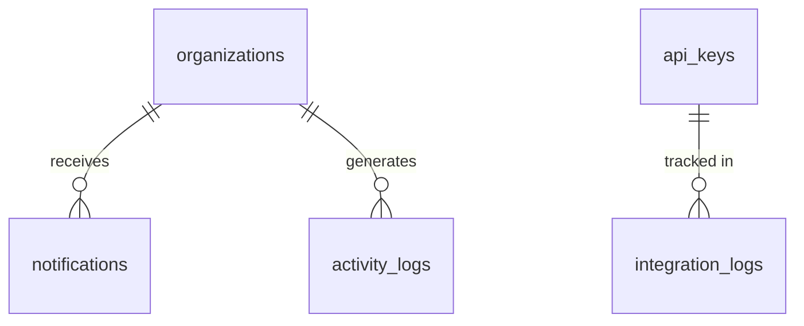

**Schema Details:**

| Table | Column | Type | Constraints | Notes |
|---|---|---|---|---|
| **notifications** | id | uuid | PK, NN | |
| | recipient_type | text | NN | user\|org\|lodge\|agent\|admin |
| | recipient_id | uuid | NN | |
| | type | text | NN | tree_status\|reimbursement\|allocation\|payment\|certificate\|update\|system |
| | title | text | NN | |
| | message | text | | |
| | action_url | text | | |
| | is_read | boolean | default false | |
| | related_table / related_id | text / uuid | | Polymorphic link |
| | created_at | timestamptz | | |
| **activity_logs** | id | uuid | PK, NN | |
| | user_id | uuid | FK→users.id | Nullable for system events |
| | organization_id | uuid | FK→organizations.id | |
| | action_type | text | NN | create\|update\|delete\|login\|approve\|reject |
| | resource_type | text | NN | tree\|user\|org\|ticket\|… |
| | resource_id | uuid | | |
| | old_values / new_values | jsonb | | |
| | ip_address / user_agent | text | | |
| **integration_logs** | id | uuid | PK, NN | |
| | integration_type | text | NN | api_key\|webhook\|partner |
| | partner_id | uuid | FK→organizations.id | |
| | action | text | NN | call\|error\|auth_fail |
| | endpoint | text | | |
| | status_code | text | | |
| | error_message | text | | |
| **api_keys** | id | uuid | PK, NN | |
| | organization_id | uuid | FK→organizations.id | |
| | key_hash | text | UK, NN | SHA-256 |
| | key_prefix | text | UK | First 8 chars |
| | name | text | NN | |
| | scopes | text[] | | read:trees\|write:planting\|… |
| | rate_limit_per_hour | integer | default 1000 | |
| | active | boolean | default true | |
| **settings** | key | text | PK | Namespaced: gateway.stripe_key |
| | value | jsonb | | |
| | data_type | text | | string\|number\|boolean\|json |
| | is_public | boolean | default false | |

**Relationships:** `notifications.recipient_type/recipient_id` — polymorphic (user, org, lodge, agent, admin). `activity_logs.user_id → users` (nullable). `activity_logs.organization_id → organizations` (org-scoped audit trail). `integration_logs.partner_id → organizations` (partner API/webhook usage). `api_keys.organization_id → organizations` (partner API credentials, hashed). `settings` — flat key/value store with JSON values, namespaced by key (e.g., `gateway.stripe_key`, `mailer.sender`, `feature_flags.new_dashboard`).

---

## 2. API Conventions & Recommended Stack

- **Stack:** Node.js 20+, Express or Fastify, Postgres (serverless driver `pg` with pooled connection string, or Drizzle ORM — schema can be generated from the existing 149 migrations), `jsonwebtoken` for auth, `bcrypt` for password hashing, Zod for request validation, Resend/SES/Postmark for email (Supabase GoTrue currently sends all emails — you must bring a mailer).
- **Base URL:** all endpoints below live under `/api/v1`.
- **Auth:** `Authorization: Bearer <JWT>` access token (15 min) + httpOnly refresh-token cookie (30 days). JWT claims: `{ sub: user_id, role, organization_id }` — this replaces the `get_user_role` RPC round-trip on every route guard.
- **Errors:** uniform `{ "error": { "code": "string", "message": "string" } }` with proper HTTP status. The Supabase client's `{ data, error }` shape disappears — wrap the new API client so pages keep a similar calling convention during migration.
- **Pagination:** `?page=&limit=` returning `{ data, total, page, limit }` on all list endpoints.
- **Role middleware:** `requireAuth`, `requireRole('super_admin', ...)`, `requireOrgAdmin(orgIdParam)`, `requireModulePermission(module, action)` — direct ports of `_shared/authz.ts` + the RLS helper functions.

**Frontend wiring (global):** replace `src/integrations/supabase/client.ts` with a single `src/lib/api.ts` fetch wrapper that injects the Bearer token, auto-refreshes on 401, and returns `{ data, error }` so existing call sites migrate mechanically. Keep react-query as the cache layer — only the `queryFn` bodies change from `supabase.from(...)` to `api.get(...)`.

---

## 3. Current Status Audit — What's Mock vs Functional

Confirms the "frontend-heavy, not functional" read. Full-repo audit of every routed page:

| Area | Status today | What makes it functional |
|---|---|---|
| **Payments / checkout** (`TreePurchase.tsx`) | MOCK Payment-method picker is cosmetic; payment reference is literally `SIMULATED-${Date.now()}`. No payment SDK exists anywhere in `src/`. | Section 23 checkout + webhook endpoints with a real gateway. |
| **Agent offset payment** (`AgentCalculateOffset.tsx`) | MOCK "Paid" checkbox just stamps `payment_date`. | Section 24 ticket creation + section 23 payment flow if agents pay online, or keep as recorded-offline payment. |
| **Certificates** | BROKEN PDFs render client-side, but the `certificates` table is read-only everywhere — no code ever inserts a row, so "My certificates" lists are always empty. QR codes on certificates point to `/verify`, a route that doesn't exist → 404. | Section 23 server-side issuance (triggered by payment webhook) + public `/verify/:id` endpoint & page. |
| **Contributor updates** (`SendUpdateDialog.tsx`) | BROKEN Invokes edge fn `send-contributor-update` which does not exist in the repo. | Section 24 `/send-update` endpoint + mailer. |
| **Email / SMS / push** | MISSING Notifications are in-app only (and only surfaced in the lodge portal). All email today is GoTrue auth email; the dedication-email TODO in checkout is unsent. | Mailer integration used by sections 23, 24. |
| **Lodge: Performance page** | MOCK 100% Score 4.8/5, rank "#2 of 89 lodges", reviews from "Jane Doe / Mike Chen" — all hardcoded; no reviews table exists. | Section 23 performance endpoint (computable from real data). |
| **Lodge: Help page & contact form** | MOCK Static guides/FAQ; contact form submits nowhere. `/lodge/settings` sidebar link → 404. | Section 23 support-request endpoint (or drop the form). |
| **Admin: 14 placeholder routes** | MOCK `/admin/access/custom`, `/admin/activity`, `/admin/audit`, `/admin/config/{system,payment,email,flags}`, `/admin/api/{keys,webhooks,logs}`, `/admin/security`, 3 user sub-pages — all render "Coming soon". | Section 24 config endpoints (API keys, audit, settings); build pages against them. |
| **Admin: God-Mode overview** | MOCK User/tree/transaction counts are real; growth percentages are literals and "active sessions" is `Math.random()`. | Section 24 `/admin/analytics/overview`. |
| **Admin: Financial transactions** | PARTIAL Derives "transactions" from the `trees` table, not from `partner_transactions`. | Section 24 `/finance/transactions`. |
| **Tourist: landing, /certificates, MyImpact bits** | PARTIAL Landing page fully static; `/certificates` route renders a literal "will be implemented next" stub; MyImpact share link targets `/impact/:userId` which isn't routed; Mapbox token hardcoded in source. | Section 24 `/public/impact/:userId`, section 23 certificate list, env-var the Mapbox token. |
| **Tourist: edit trip** | TODO STUB `MyTrips.tsx:190` shows a "will be implemented soon" toast. | Section 24 `PATCH /trips/:id`. |
| **Deep links** | HALF-BUILT Validation is wired into all pledge pages, but nothing ever creates a deep link (`deeplink-create` has zero callers — no QR/campaign minting UI). | Section 23 `/deeplinks` + an admin campaign screen. |
| **Everything else** | Functional against Supabase: auth, magic links, pledge flow, trees/MDM/nursery ops, org permissions, agent tickets, institutional dashboards, Templates Studio, activity logs. | 1:1 endpoint swap per sections below. |

**Dead code — don't migrate:** `travel_agent_sessions` + `is_agent_session_valid` (unused), `LodgeRoute.tsx`, unrouted pages `TechDashboard.tsx` / `OwnerSettings.tsx` / `InstitutionalAgentTickets.tsx`, legacy `TreesManagement.tsx` (shadowed by a duplicate `/admin/trees` route), and the duplicated unreachable `/lodge/*` route declarations in `App.tsx`.

---

## 4. Auth — Tourist / Admin / Org Users (JWT)

Replaces Supabase Auth (GoTrue) for everyone using `AuthContext`: tourists, super admins, owners, institutional partners, travel agents. Passwords move to bcrypt hashes in your own `users` table (the current `users.password_hash` column is only a `"set"` marker — real hashes live inside GoTrue and cannot be exported as plaintext; they can be exported as bcrypt hashes via Supabase's admin API/dump, or you force a reset-password flow on first login).

| Method | Endpoint | Purpose / replaces |
|---|---|---|
| POST | `/auth/signup` | REPLACES `supabase.auth.signUp`. Body `{email, password}`. Creates `users` row (replicating the `handle_new_user` trigger), sends verification email, returns `{needsEmailConfirmation:true}`. Must reproduce the "already registered" detection the UI relies on. |
| POST | `/auth/login` | REPLACES `signInWithPassword`. Returns `{accessToken, user:{id, email, role, organizationId}}` + refresh cookie. Role comes back in the login response — kills the follow-up `get_user_role` RPC. |
| POST | `/auth/refresh` | NEW Rotate refresh cookie → new access token. Replaces supabase-js `autoRefreshToken`. |
| POST | `/auth/logout` | REPLACES `supabase.auth.signOut`. Revokes refresh token. |
| GET | `/auth/me` | NEW Session hydration on app boot: `{user, role, organizationId}`. Replaces `onAuthStateChange` + `get_user_role` in every route guard (`ProtectedRoute`, `OwnerRoute`, `PortalGate`, ...). |
| POST | `/auth/verify-email` | REPLACES GoTrue confirmation link. Body `{token}`. |
| POST | `/auth/resend-verification` | REPLACES `auth.resend({type:'signup'})`. |
| POST | `/auth/forgot-password` | REPLACES `resetPasswordForEmail`. Always 200 (no enumeration). |
| POST | `/auth/reset-password` | REPLACES reset flow + edge fn `set-password`. Body `{token, newPassword}`. |
| GET | `/auth/google` → `/auth/google/callback` | REPLACES `signInWithOAuth({provider:'google'})` (tourist portal only). Standard OAuth2 code flow with Passport or `arctic`; callback issues the same JWT pair and redirects to `/auth/callback`. |

**Frontend wiring:** rewrite `src/contexts/AuthContext.tsx` to call these endpoints and keep the same exported interface (`signIn`, `signUp`, `resetPassword`, `user`, `session`) so the ~40 consumer components don't change. Store the access token in memory (context) and rely on the httpOnly refresh cookie for persistence; on boot call `/auth/me` once and pass role down — route guards then read role from context instead of calling an RPC each mount.

---

## 5. Auth — Magic Links & Pledge Deep Links

Replaces edge functions `magic-link-send`, `magic-link-verify`, `deeplink-create`, `deeplink-validate` and tables `magic_tokens` / `ephemeral_sessions`. Keep the same SHA-256-hashed single-use token design — it's good. You must add a real mailer: today the actual email is sent by GoTrue's `signInWithOtp`, which disappears with Supabase.

| Method | Endpoint | Purpose / replaces |
|---|---|---|
| POST | `/auth/magic-link` | REPLACES `magic-link-send`. Body `{email, pledgeContext?, deviceFingerprint?}`. Rate-limit 5/email/hour (429), insert hashed token (24 h TTL), email link `${APP_URL}/auth/magic?token=…` via your mailer, write `auth_logs`. |
| POST | `/auth/magic-link/verify` | REPLACES `magic-link-verify`. Body `{token}`. Consume token → find-or-create user (email pre-verified) → if `pledge_context` carries `numTrees/tripId`, create the pledge `trees` row → return the same JWT pair as /auth/login plus `{isNewUser, redirectUrl, pledgeContext}`. No more GoTrue `action_link` double-redirect dance. |
| POST | `/deeplinks` | REPLACES `deeplink-create`. Body `{campaign?, tripId?, redirectUrl?, ttlSeconds=900, pledgeContext?}` → `{deepLinkUrl, universalLink, token, expiresAt}`. Add rate limiting + an API key — the current function is fully unauthenticated and unthrottled. Note: nothing in the UI calls create today (validation is wired into the pledge pages, creation has zero callers) — an admin "mint campaign QR/deep link" screen is the missing half. |
| POST | `/deeplinks/validate` | REPLACES `deeplink-validate`. Body `{token}` → single-use consume → `{pledgeContext, expiresIn}`. Drop the fake "ephemeral_token" the old function minted but never persisted. |

**Frontend wiring:** `src/utils/magicLinkAuth.ts` and `src/utils/deepLink.ts` are already thin fetch wrappers around the edge-function URLs — just point them at the new endpoints. `src/pages/auth/MagicLink.tsx` simplifies a lot: instead of redirecting to a GoTrue `authUrl` and round-tripping through `VerifyEmail.tsx` + sessionStorage, it verifies the token, stores the returned JWT via AuthContext, and navigates straight to `redirectUrl`.

---

## 6. Auth — Lodge (Username/Password)

Replaces edge functions `lodge-login` / `lodge-session-validate` / `lodge-logout`, the service-role RPCs `verify_lodge_password` / `set_lodge_password`, and tables `lodge_credentials` / `lodge_sessions`. Recommended: fold lodges into the same JWT system with `role:'lodge'` and a `lodge_id` claim — one auth system instead of three. If you want zero frontend churn, mirror the current token contract instead (shown below).

| Method | Endpoint | Purpose / replaces |
|---|---|---|
| POST | `/auth/lodge/login` | REPLACES `lodge-login`. Body `{username, password}` → bcrypt check against `lodge_credentials` → `{sessionToken, expiresAt, lodge:{id,name,location}}` (7-day token in `lodge_sessions`), or a JWT if consolidating. Generic 401 message on any failure (current behavior, keep it). |
| GET | `/auth/lodge/session` | REPLACES `lodge-session-validate`. Header `x-lodge-session` → `{valid, lodge}`. |
| POST | `/auth/lodge/logout` | REPLACES `lodge-logout`. Deletes the session row. |
| PUT | `/admin/lodges/:id/credentials` | REPLACES edge fn `admin-set-lodge-password` + RPC `set_lodge_password`. Auth: platform admin. Body `{username, password}`; 409 on username collision. |

**Frontend wiring:** `src/contexts/LodgeAuthContext.tsx` keeps its exact shape (localStorage `lodge_session_token` + `lodge_id`, boot-time validate call) — only the three `functions.invoke(...)` calls change to fetches. `src/pages/lodge/PlantTree.tsx` keeps sending the token in the `x-lodge-session` header, now to `/lodge/trees/:id` (section 13).

---

## 7. Auth — Travel Agent

**Good news:** despite its name, `AgentAuthContext` is not a separate auth system — agents log in through normal Supabase Auth, then the context checks `get_user_role === 'travel_agent'` and loads their `travel_agents` profile by email. The `travel_agent_sessions` table and `is_agent_session_valid` RPC are dead code — do not migrate them.

| Method | Endpoint | Purpose / replaces |
|---|---|---|
| GET | `/agent/profile` | REPLACES the context's direct query on `travel_agents` (joined to `organizations(name)`) by session email. Auth: JWT with `role='travel_agent'`. |

**Frontend wiring:** agents use the same `/auth/login` as everyone else (section 4). `AgentAuthContext` reduces to: read role from `/auth/me`; if `travel_agent`, fetch `/agent/profile`. Delete the sessions-table plumbing.

---

## 8. Users, Roles & Profile

Replaces direct queries on `users` (76 call sites — the most-touched table), `roles`, `user_roles`, plus edge functions `delete-user` and `admin-set-user-password`.

| Method | Endpoint | Purpose / replaces |
|---|---|---|
| GET | `/users/me` | REPLACES profile reads (`Profile.tsx`, dashboards): profile + `otot_id`, `pledge_status`, `total_donation`. |
| PATCH | `/users/me` | REPLACES profile self-updates (name, phone, photo URL). |
| GET | `/admin/users` | REPLACES admin user-list queries. Filters: `?role=&organization_id=&search=&pledge_status=`. Auth: platform admin. |
| POST | `/admin/users` | REPLACES edge fns `create-owner-user`, `create-partner-user`, `create-agent-user` — unify as one endpoint: body `{name, email, password, role, organization_id, category?}`. Keep the role rules: `government_partner` callers may only create agents inside their own org; owner/partner creation is platform-admin only. Idempotent on existing email (update password + role like today). |
| PATCH | `/admin/users/:id` | REPLACES admin edits to `users` rows (role, org, active flags). |
| PUT | `/admin/users/:id/password` | REPLACES edge fn `admin-set-user-password`. Auth: platform admin. |
| DELETE | `/admin/users/:id` | REPLACES edge fn `delete-user`. Auth: super_admin only. Deletes `users` row + credentials; decide cascade policy for their trees/trips. |

**Frontend wiring:** admin user-management pages currently mix direct `supabase.from('users')` queries with `functions.invoke('create-*-user')` per audience — all of it converges on `/admin/users`. The three create dialogs (owner/partner/agent) become one API call with a different `role` value.

---

## 9. Organizations, Modules & Permissions

Replaces direct CRUD on `organizations`, `partner_types`, `modules`, `organization_modules`, `org_users`, `org_custom_roles`, `org_role_permissions`, `org_user_permissions`, and edge fn `org-invite-user`. This powers `useModulePermissions` and all owner/institutional sidebars.

| Method | Endpoint | Purpose / replaces |
|---|---|---|
| GET/POST/PATCH | `/admin/organizations` / `/:id` | REPLACES admin org CRUD (33 call sites). Include archive/verify/activate toggles as PATCH fields. |
| GET/POST/PATCH | `/admin/partner-types` / `/:id/modules` | REPLACES `partner_types` + `partner_type_modules` config CRUD. |
| GET/PUT | `/orgs/:orgId/modules` / `/admin/organizations/:id/modules` | REPLACES `organization_modules` reads (sidebar building) and admin grants. |
| GET | `/orgs/:orgId/users` | REPLACES `useOrgUsers` queries on `org_users`. |
| POST | `/orgs/:orgId/users/invite` | REPLACES edge fn `org-invite-user`: create-or-update user + `org_users` row + seed `org_user_permissions` from `org_job_role_defaults`. Auth: org admin of `:orgId` (port of `isOrgAdminOf`). |
| GET/POST/PATCH/DELETE | `/orgs/:orgId/roles` / `/:roleId/permissions` | REPLACES `org_custom_roles` + `org_role_permissions` CRUD (`useOrgCustomRoles`, `useOrgRolePermissions`). |
| GET | `/me/permissions` | NEW One call returning the caller's effective module permissions — collapses the 4-table walk in `useModulePermissions` (users → org_users → org_custom_roles → org_role_permissions, fallback organization_modules, org_admin short-circuit) into a single server-side resolution. Also fold in the tourist toggles (`tourist_module_permissions`). |

**Frontend wiring:** `useModulePermissions` and its sibling hooks become one `useQuery(['me','permissions'])` over `/me/permissions` — the client-side permission-resolution logic (and its subtle fallback bugs) is deleted, and sidebars/guards read from a single cached result. Admin config screens map 1:1 to the CRUD endpoints.

---

## 10. CO2 Calculator & Trips

Replaces direct CRUD on `trips` (20 call sites), `carbon_offset_calculations`, `tree_sequestration_rates`, and the browser's direct call to the external emission API (`VITE_EMISSION_API_URL`).

| Method | Endpoint | Purpose / replaces |
|---|---|---|
| POST | `/carbon/flight-estimate` | NEW Proxy to the external emission API (moves `VITE_EMISSION_API_KEY` server-side — today the key ships in the JS bundle). Keeps the local-formula fallback. Body: `{legs:[{origin,destination,travelClass}], accommodation?}`. |
| GET | `/carbon/species-rates` | REPLACES reads on `tree_sequestration_rates` (trees-needed math). |
| POST | `/carbon/calculations` | REPLACES inserts into `carbon_offset_calculations` (calculator session snapshot incl. `flight_legs_json`, `trees_needed`). |
| POST | `/trips` | REPLACES trip inserts. Server generates `friendly_trip_id` and stamps `organization_id` (ports the `generate_friendly_trip_id` + `stamp_trip_organization_id` triggers). |
| GET | `/trips` · `/trips/:id` | REPLACES "my trips" reads on dashboard/pledge pages. Scope by caller (own trips; org trips for agents/partners). |
| PATCH | `/trips/:id` | NEW MOCK Edit trip — the button in `MyTrips.tsx:190` is a "will be implemented soon" TODO toast today. Body: airports, travel class, dates; server recomputes CO2/trees_needed. |
| DELETE | `/trips/:id` | REPLACES trip delete in `MyTrips.tsx` (own trips only; block if trees are already attached). |

**Frontend wiring:** the calculator flow (`CO2Calculator.tsx` → sessionStorage `calculator-data` → pledge) stays client-driven; only the emission API call and the final persistence swap to these endpoints. Guest users can run the calculator unauthenticated — make `/carbon/flight-estimate` and `/carbon/species-rates` public, and persist the calculation/trip only once an identity exists (magic-link or login).

---

## 11. Pledge / Checkout / Payments

The revenue path. Today: inserts into `tourist_purchases` + `trees`, with DB triggers fanning out to the `contribution_tracking` ledger. There is no real payment processor anywhere in the code — "payment" is a form field. Making this functional needs a gateway integration.

| Method | Endpoint | Purpose / replaces |
|---|---|---|
| GET | `/pledge/tiers` | REPLACES reads on `contribution_tiers` + `contribution_tier_visibility` (+ active `planting_cost_configs` pricing). Query: `?portal=tourist|agent|lodge`. Public. |
| GET | `/pledge/planting-locations` | REPLACES reads on `planting_locations` (`show_in_tourist`, ordered). Public. |
| POST | `/pledge/checkout` | NEW Create a payment intent: body `{tierKey | numTrees, tripId?, dedication?, paymentMethod}` → creates a pending `tourist_purchases` row and returns the gateway checkout payload (Stripe PaymentIntent client secret / M-Pesa STK push / Flutterwave link — pick per market; M-Pesa matters for Kenya). Replaces today's "insert a purchase row and call it paid". |
| POST | `/payments/webhook/:provider` | NEW Gateway webhook. On success: mark purchase paid → create `trees` row(s) → write `contribution_tracking` ledger row (port the sync triggers as one transactional service function) → update `users.pledge_status`/`total_donation` → queue certificate + notification. This transaction is the heart of the migration. |
| GET | `/pledge/purchases/:id` | NEW Poll payment/fulfillment status for the post-checkout confirmation page. |
| GET | `/me/purchases` | REPLACES purchase-history reads on `tourist_purchases`. |

**Frontend wiring:** the three pledge variants (`Pledge.tsx`, `PledgeB.tsx`, `PledgeC.tsx`) keep their sessionStorage-driven step flow; the final "confirm" step changes from direct table inserts to `POST /pledge/checkout` → gateway UI → redirect to a confirmation page that polls `/pledge/purchases/:id`. Anonymous flows first pass through the magic-link capture (section 5) so the purchase has a `user_id`.

---

## 12. Trees & Lifecycle Tracking

Replaces direct CRUD on `trees` (45 call sites), `tree_status_transitions` (21), `tree_geotags`, `tree_growth_metrics`, `tree_survival_tracking`/`tree_survival_records`, `tree_monitoring_logs`, `tree_planting_assignments`, `certificates`.

| Method | Endpoint | Purpose / replaces |
|---|---|---|
| GET | `/me/trees` | REPLACES tourist "My Trees" reads (trees + geotags + latest status + photos, one joined payload). |
| GET | `/trees` | REPLACES scoped list for staff portals. Filters: `?status=&planting_status=&owner_org_id=&lodge_id=&beat_id=&search=`. Auth middleware scopes by role (owner sees own org's, lodge sees own, admin sees all). |
| GET | `/trees/:id` | REPLACES detail reads: tree + transitions + growth metrics + geotag + impact records. |
| POST | `/trees/:id/transitions` | REPLACES inserts to `tree_status_transitions` (StatusTransitionPanel). Body `{toStatus, transitionData?, photos?}`. Server validates the status graph, updates `trees.status/planting_status`, and fires the `notify_tree_status_change` notification (ported trigger). |
| PUT | `/trees/:id/geotag` | REPLACES upserts on `tree_geotags`. |
| POST | `/trees/:id/growth` | REPLACES inserts on `tree_growth_metrics`. |
| POST | `/trees/:id/survival` | REPLACES both survival tables — consolidate on one (`tree_survival_records` has the proper enum) during migration. |
| POST | `/contributions/:contributionId/assignments` | REPLACES `tree_planting_assignments` CRUD (assign beat, nursery, planter, species, dates). Auth: owner org with module permission. |
| POST | `/contributions/:contributionId/monitoring` | REPLACES `tree_monitoring_logs` inserts (alive/dead/replaced rollups). |
| GET | `/public/impact/:userId` | NEW Public read-only impact summary (trees, CO2, map points). The MyImpact "share my impact" link already points to `/impact/:userId` — a route that 404s today. Add this endpoint + the public page it feeds. |

**Frontend wiring:** "My Trees" and the various owner/admin tree tables are the heaviest direct-query surfaces in the app — each page's react-query `queryFn` swaps to the scoped `/trees` list with filters matching its current `.eq()` chains. The status-transition panel posts to one endpoint instead of doing insert-transition + update-tree + insert-notification as three client-side writes (which is currently not atomic).

---

## 13. Lodge Portal

Replaces edge fn `lodge-update-tree`, direct reads on `trees`/`lodges`, and `reimbursements` CRUD + the `reimbursement-docs` bucket.

| Method | Endpoint | Purpose / replaces |
|---|---|---|
| GET | `/lodge/trees` | REPLACES lodge dashboard tree list (`trees.lodge_id = session lodge`). Auth: lodge session/JWT. |
| POST | `/lodge/trees` | REPLACES the "plant a tree" insert from `PlantTree.tsx` (tree + photos + geotag in one call). |
| PATCH | `/lodge/trees/:id` | REPLACES edge fn `lodge-update-tree`: partial update (type, plant date, lat/lng, carer, notes, images, status with enum validation), 403 unless the tree belongs to this lodge. |
| GET/POST | `/lodge/reimbursements` | REPLACES `reimbursements` reads/inserts (`LodgeReimbursements.tsx`). POST accepts uploaded document URLs (section 22); server fires `notify_reimbursement_created`. |
| PATCH | `/admin/reimbursements/:id` | REPLACES the legacy admin approve/reject updates on `reimbursements` (`admin/Reimbursements.tsx`). |
| GET | `/lodge/performance` | NEW MOCK `LodgePerformance.tsx` is 100% hardcoded (fake score, fake rank, fake reviews). Compute the real half from existing data: trees planted vs targets, survival rate, avg time-to-planted, rank among lodges. Reviews need a new `lodge_reviews` table + tourist-facing submit endpoint if the feature is wanted — otherwise cut that card. |
| POST | `/support/requests` | NEW MOCK The lodge Help contact form currently submits nowhere. Store + email to support. (Or delete the form.) |
| GET | `/lodge/notifications` | REPLACES lodge notification inbox reads/updates — same handlers as section 21, keyed by `recipient_type='lodge'`. |

**Frontend wiring:** lodge pages authenticate via `x-lodge-session` (or the consolidated JWT) — add that header in the shared api client when `LodgeAuthContext` is active. `PlantTree.tsx` currently does photo upload + tree insert + geotag as separate Supabase calls; collapse to upload (section 22) then one POST.

---

## 14. Travel Agent Portal

Replaces direct CRUD on `agent_tickets` (17 call sites) and `travel_agents` (16), plus the ticket→contribution/trip sync triggers.

| Method | Endpoint | Purpose / replaces |
|---|---|---|
| GET | `/agent/tickets` | REPLACES agent ticket-list reads (own `agent_id` scope). Filters: `?tree_status=&ktb_payment_status=&search=`. |
| POST | `/agent/tickets` | REPLACES ticket creation (PNR, ticket no., CO2 fields, trees_needed). Server ports `sync_agent_ticket_to_contribution` + `sync_agent_ticket_to_trip` triggers: creates the trip + ledger rows transactionally. |
| PATCH | `/agent/tickets/:id` | REPLACES ticket edits (status transitions, LPO number). |
| GET | `/agent/summary` | NEW Dashboard aggregates (tickets, trees needed vs planted, KTB payment totals) — currently computed client-side over full table pulls. |
| GET/POST/PATCH | `/admin/agents` / `/:id` | REPLACES admin/ministry management of `travel_agents` (activate/deactivate, org assignment). |

**Frontend wiring:** agent pages already gate on role via `AgentRoute`; queries swap 1:1. Invoice/receipt URLs on tickets (`invoice_url`, `receipt_url`) come from the documents feature (section 19) — generate server-side and store the URL on the ticket so the agent list can link them directly.

---

## 15. Owner Portal (Nurseries, MDM, Planting Ops)

Replaces direct CRUD on `nurseries`, `nursery_species`, `seed_species`, `seedling_batches`, `planting_records`, `monitoring_records`, `tree_carers`, the 5-level `mdm_location_*` hierarchy, and `mdm_audit_log`.

| Method | Endpoint | Purpose / replaces |
|---|---|---|
| GET/POST/PATCH/DELETE | `/owner/nurseries` / `/:id` | REPLACES nursery CRUD, scoped `owner_org_id = caller org`. |
| GET/PUT | `/owner/nurseries/:id/species` | REPLACES `nursery_species` availability management (15 call sites). |
| GET/POST/PATCH | `/species` | REPLACES `seed_species` catalog reads (shared by owner + calculator). |
| GET/POST/PATCH | `/owner/batches` | REPLACES `seedling_batches` CRUD. |
| GET/POST/PATCH | `/owner/planting-records` + nested `/monitoring` | REPLACES `planting_records` + `monitoring_records` CRUD (field ops). |
| GET/POST/PATCH | `/owner/carers` | REPLACES `tree_carers` registry (planters), incl. photo upload URL + beat assignment. |
| GET/POST/PATCH/DELETE | `/mdm/locations?level=county|subcounty|block|station|beat&parent_id=` | REPLACES the 5 `mdm_location_*` tables' CRUD. Every write also appends `mdm_audit_log` server-side (14 call sites currently do this manually from the client). |
| GET | `/owner/dashboard-summary` | NEW Aggregates for the owner dashboard (trees by status, survival rate, beat targets vs planted) — currently assembled from several full-table client pulls. |

**Frontend wiring:** owner pages are permission-gated by `useModulePermissions` — server must enforce the same module/action checks via `requireModulePermission` (from section 2's resolver) so the UI toggles and API agree. MDM screens keep their tree-drilldown UX; the audit-log write moves out of the client entirely.

---

## 16. Finance — Contributions Ledger, Disbursements, Pricing

Replaces reads/writes on `contribution_tracking` (15 call sites), `partner_transactions`, `owner_disbursements`, `planting_cost_submissions`, `planting_cost_configs`, `wallet_settings`, and the reconciliation view/function.

| Method | Endpoint | Purpose / replaces |
|---|---|---|
| GET | `/finance/contributions` | REPLACES ledger reads. Role-scoped: admin sees all; owner sees own-org rows; ministry sees institution rows. Filters: `?status=&source_table=&from=&to=`. |
| PATCH | `/finance/contributions/:contributionId/receipts` | REPLACES stakeholder receipt-confirmation updates (ktb/tech/institution/partner receipt ids + dates; ports `auto_populate_receipt_fields`). |
| GET/POST/PATCH | `/finance/disbursements` / `/:id` | REPLACES `owner_disbursements` CRUD (KTB→owner payouts, reconciliation status). |
| GET/POST/PATCH | `/finance/transactions` / `/:id/approve` | REPLACES `partner_transactions` incl. the approve step (`approved_by/at`). |
| POST/GET/PATCH | `/finance/cost-submissions` / `/:id/review` | REPLACES owner cost proposals (`planting_cost_submissions`) + admin review; review approval creates the new `planting_cost_configs` row and flips `is_active`, then notifies via `planting_cost_notifications`. |
| GET | `/finance/active-config` | REPLACES `useActivePlantingConfig` reads (the active pricing config drives all tier pricing). Public read (pricing is shown to tourists). |
| POST | `/finance/reconcile` | REPLACES RPC `reconcile_contribution_sources()` + view `v_contribution_source_drift` (add GET `/finance/drift`). Auth: super_admin. |

**Frontend wiring:** financial dashboards (`OwnerFinancial.tsx`, admin wallet screens) currently pull raw ledger rows and aggregate in the browser — add server-side totals to the list responses (`{data, totals:{paid, received, retained, transferred}}`) so the UI stops recomputing money client-side. The realtime pricing-config subscription becomes a react-query refetch on the checkout page (section 11).

---

## 17. Institutional / Ministry Portal

Ministry (`government_partner`) users manage agents in their org, view org-scoped trees/trips/contributions, and track KTB payment status on agent tickets. Mostly reuses sections 9/14/16 endpoints with org scoping; the extra pieces:

| Method | Endpoint | Purpose / replaces |
|---|---|---|
| GET | `/institutional/summary` | NEW Org-level dashboard aggregates (tickets, trees, CO2, payment status counts) — currently client-side over full pulls. |
| GET | `/institutional/agents` | REPLACES org-scoped `travel_agents` reads; creation goes through `/admin/users` (section 8) with the gov-partner same-org rule. |
| PATCH | `/institutional/tickets/:id/payment-status` | REPLACES ministry updates to `agent_tickets.ktb_payment_status`. |

**Frontend wiring:** the institutional portal is served from `office.onetouristonetree.com` — host-based portal separation (`src/lib/portal.ts`, `PortalGate`) is purely client-side and survives unchanged; the server just enforces role+org on every request so the portal split is no longer trust-bearing.

---

## 18. Super-Admin Portal & Platform Config

Beyond user/org management (sections 8–9) and finance (section 16), the admin portal owns platform config tables. All endpoints auth: `super_admin` (or `admin` where the current RLS allows).

| Method | Endpoint | Purpose / replaces |
|---|---|---|
| GET/POST/PATCH/DELETE | `/admin/config/tiers` / `/:id/visibility` | REPLACES `contribution_tiers` + per-portal visibility CRUD. |
| GET/POST/PATCH/DELETE | `/admin/config/planting-locations` | REPLACES `planting_locations` CRUD incl. photo + sort order. |
| GET/PATCH | `/admin/config/modules` | REPLACES `modules` / `module_sub_actions` registry edits + tourist toggles (`tourist_module_permissions`). |
| GET/PUT | `/admin/config/wallet-settings` | REPLACES `wallet_settings` key/value edits (fee percentages). |
| GET/POST/DELETE | `/admin/api-keys` / `/:id` | REPLACES `api_keys` management for partner API access (hash on create, show prefix only). Partner-facing API auth middleware validates `key_hash` + scopes + rate limit, logging to `integration_logs`. |
| GET | `/admin/analytics/overview` | NEW MOCK Platform KPIs for the God-Mode dashboard. Today's page mixes real counts with literal growth percentages and `Math.random()` "active sessions" — replace with real aggregates (users, trees by status, revenue from the ledger, survival, signups over time). |
| GET/PUT | `/admin/settings` / `/:key` | NEW MOCK Backing for the placeholder config pages (`/admin/config/system`, `/payment`, `/email`, `/flags`): a namespaced key/value settings store (gateway keys, mailer sender, feature flags). Generalizes `wallet_settings`. |
| GET/POST/PATCH/DELETE | `/admin/webhooks` | NEW MOCK Backing for `/admin/api/webhooks` and the partner-wizard's API step (currently saves nothing): partner webhook subscriptions + delivery log. |
| GET | `/admin/integration-logs` | REPLACES `integration_logs` reads (AlertsPanel) and backs the `/admin/api/logs` placeholder page. |
| GET | `/admin/audit` | NEW MOCK Backing for `/admin/audit` + `/admin/security` placeholders: unified feed over `auth_logs` + `mdm_audit_log` + `activity_logs` with actor/resource filters. |

**Frontend wiring:** admin config pages are straightforward table CRUD — each maps to one endpoint group; the main change is that "God Mode" dashboards read pre-aggregated numbers instead of pulling whole tables.

---

## 19. Certificates, Invoices, Receipts & Templates Studio

Replaces `certificates`, `document_templates`, `template_designs`, `template_assignments`, `template_categories`, `template_engine_flags` CRUD. PDF generation is currently 100% client-side (jspdf/react-pdf) — recommended: move generation server-side so documents are durable, consistent, and emailable.

| Method | Endpoint | Purpose / replaces |
|---|---|---|
| GET | `/templates/categories` | REPLACES category catalog reads (merge fields, page setup). |
| GET/POST/PATCH | `/templates` + `/:id/designs` + `/:id/approve` | REPLACES Templates Studio CRUD: template headers, versioned `design_json`, approval workflow (`template_status`), engine flags. |
| GET | `/templates/resolve?category=&orgId=&portal=` | REPLACES `resolveTemplate.ts` scope/priority resolution (global < portal < partner) — move server-side so document rendering and the studio preview agree. |
| POST | `/documents/certificates` | NEW Server-side certificate render for a tree/pledge: resolve template → render PDF (e.g. `@react-pdf/renderer` runs fine in Node, or Playwright HTML→PDF) → store (section 22) → insert `certificates` row → return URL. Also triggered automatically by the payment webhook (section 11). |
| POST | `/documents/invoices` · `/documents/receipts` | NEW Same pattern for agent/B2B invoices and lodge receipts; store URL on `agent_tickets.invoice_url` / `partner_transactions`. |
| GET | `/me/certificates` | REPLACES tourist certificate list reads — which are always empty today: nothing in the codebase ever inserts a `certificates` row. The issuance endpoint above is what makes Dashboard/Profile certificate lists real. |
| GET | `/verify/:certificateId` | NEW Public certificate verification. Every generated certificate already embeds a QR code pointing to `/verify` — a route that doesn't exist, so all QR codes 404. Return issued-to, tree count, date, validity; add the matching public page. |

**Frontend wiring:** tourist/agent UIs change from "generate PDF in the browser on click" to "GET the stored document URL" (with a generate-on-demand fallback for legacy rows). The Templates Studio editor keeps its client-side preview but saves designs and resolves the active template through the API, eliminating the drift between client resolver and rendered output.

---

## 20. Impact Logs, Engagement & Contributor Updates

Replaces the `contribution_id`-keyed log tables (`impact_metrics`, `carbon_metrics_logs`, `community_impact`, `community_impact_logs`, `ecosystem_impact_logs`, `monitoring_logs`, `engagement_activities`, `tree_impact_records`) and the missing `send-contributor-update` function.

| Method | Endpoint | Purpose / replaces |
|---|---|---|
| GET | `/contributions/:contributionId/impact` | REPLACES combined impact reads (metrics + logs + photos) for tourist "impact" views and owner logging screens. |
| POST | `/contributions/:contributionId/impact-logs` | REPLACES inserts across the log tables (body includes `type: carbon|community|ecosystem|monitoring|engagement` — consider consolidating these near-identical tables into one during migration). |
| POST | `/contributions/:contributionId/send-update` | NEW The UI (`SendUpdateDialog.tsx`) invokes edge fn `send-contributor-update` — which does not exist in the repo. Implement it here: compose email (recipient, subject, message, optional impact summary + photos) → send via mailer → log to `engagement_activities`. This is a currently-broken feature this endpoint makes functional. |

**Frontend wiring:** `ImpactLogSliders.tsx` and the engagement screens post to the consolidated log endpoint with a `type` discriminator; `SendUpdateDialog` finally works by pointing at `/send-update`.

---

## 21. Notifications & Activity Logs

Replaces `notifications` reads, the notify-* DB triggers, `activity_logs` + the client-side monkey-patch, and `auth_logs`.

| Method | Endpoint | Purpose / replaces |
|---|---|---|
| GET/PATCH/POST | `/me/notifications` · `/:id/read` · `/me/notifications/read-all` | REPLACES notification bell reads/updates. Creation happens server-side inside the relevant services (tree status change, reimbursement created, allocation, cost workflow) — ports of the `notify_*` triggers. |
| GET | `/admin/activity-logs` and `/orgs/:orgId/activity-logs` | REPLACES ActivityFeed + org LogsTab reads. Filters: `?action_type=&resource_type=&from=&to=`. |

**Frontend wiring:** delete the `supabase.from()` monkey-patch in `client.ts` — activity logging becomes Express middleware that records every authenticated mutation (route, actor, org, resource) automatically, which is both complete and tamper-proof (today a client can simply not log). Page-view logging (`useAutoPageViewLogger`) can keep posting to a lightweight `POST /activity/page-view`.

---

## 22. File Uploads (Storage Replacement)

Replaces buckets `lodge-photos`, `reimbursement-docs` (private), `profile-photos`, `planting-photos`. Recommended: S3-compatible object storage (Cloudflare R2 is the cheap default) with presigned upload URLs so files never pass through the Node server.

| Method | Endpoint | Purpose / replaces |
|---|---|---|
| POST | `/uploads/presign` | NEW Body `{purpose: 'lodge-photo'|'reimbursement-doc'|'profile-photo'|'planting-photo', filename, contentType}` → validates MIME/size per purpose (5–10 MB caps as today) → returns `{uploadUrl, fileUrl}`. Client PUTs the file to `uploadUrl`, then stores `fileUrl` in the relevant record exactly as it stores public URLs now. |
| GET | `/uploads/reimbursement-docs/:key` | NEW Authenticated redirect to a presigned GET for the private bucket. (Note: the current code calls `getPublicUrl` on this private bucket — those links are already broken; this endpoint fixes that too.) |

**Frontend wiring:** every `.upload() + .getPublicUrl()` pair (PlantTree, LodgeReimbursements, Profile, OwnerMdmPlanters, ImpactLogSliders, StatusTransitionPanel, OwnerOrders, PlantingLocationsConfig) becomes presign → PUT → save URL. Wrap it once as `uploadFile(purpose, file): Promise<url>` in the api client and swap call sites mechanically.

---

## 23. Realtime Replacement

Only three `postgres_changes` subscriptions exist, and none needs true websockets:

- **Admin ActivityFeed** — already polls every 5 s alongside the subscription; keep polling `GET /admin/activity-logs?after=<cursor>`.
- **Org LogsTab** — subscription only triggers a refetch; use react-query `refetchInterval` on `/orgs/:orgId/activity-logs`.
- **useActivePlantingConfig** — subscription only invalidates the cache; poll `/finance/active-config` with a 60 s `staleTime` (pricing changes are rare).

**Frontend wiring:** delete the three `supabase.channel()` blocks and set `refetchInterval` on the corresponding queries. If live push is ever genuinely needed, add one SSE endpoint backed by Postgres LISTEN/NOTIFY later — don't build it for the migration.

---

## 24. Migration Gotchas & Landmines

- **Passwords:** GoTrue stores bcrypt hashes — export them via Supabase's admin tooling into your `users.password_hash` (bcrypt verifies identically in Node), or force password reset on first login. The current `users.password_hash = "set"` marker is not a hash.
- **Stale generated types:** `src/integrations/supabase/types.ts` predates the lodge-auth hardening migration — it still shows `lodges.username/password_hash` (dropped) and lacks `lodge_credentials`. Derive the Postgres schema from the migrations, not from types.ts.
- **Enum bug to fix in transit:** `magic-link-verify` inserts `purchase_type: "Direct"` which isn't in the `purchase_type` enum (`One-time | Subscription`) — that pledge insert silently fails today. Fix the value when porting (section 11).
- **~60 DB triggers** (ID generation, ledger sync, auto-allocation, notifications, `updated_at`) must be ported — recommended as explicit service-layer transactions in Node rather than re-created as triggers, so the logic is testable and visible. Keep `updated_at` as a trigger; port the business ones into code.
- **Polymorphic keys:** `contribution_tracking.source_table/source_id` and the text business key `contribution_id` shared across ~10 tables have no FK enforcement — keep the reconciliation endpoint (section 16) and consider adding real FKs where the data allows.
- **Duplicate systems to consolidate during migration:** two role systems (`users.role_id→roles` vs legacy `user_roles` enum — keep `roles`), two survival tables (keep `tree_survival_records`), legacy `stakeholder_*` naming remnants, dead `travel_agent_sessions`.
- **Email:** Supabase sent every email (signup confirm, reset, magic link, OTP). Budget a mailer integration + templates for all of sections 4–6, 11, 19, 20 before cutover.
- **RLS → middleware parity:** 368 policies collapse into the role/org/module middleware of section 2. Write a test matrix per endpoint (role × ownership) — this is where migrations quietly create data leaks.
